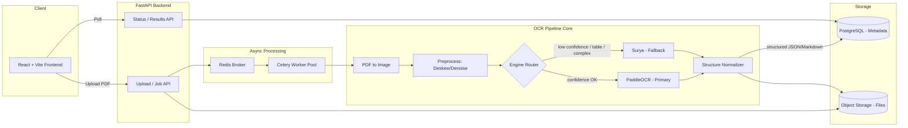
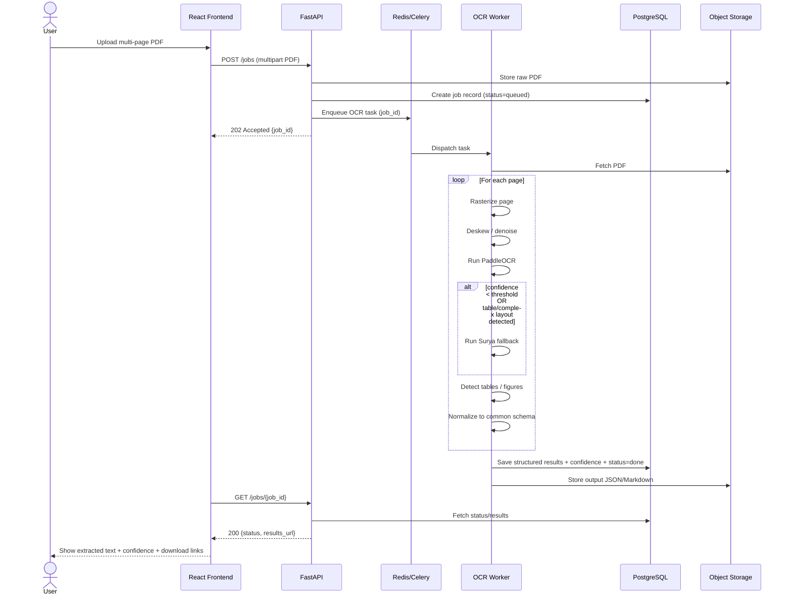
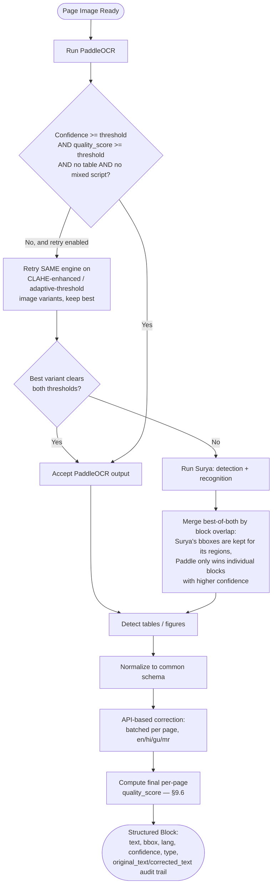
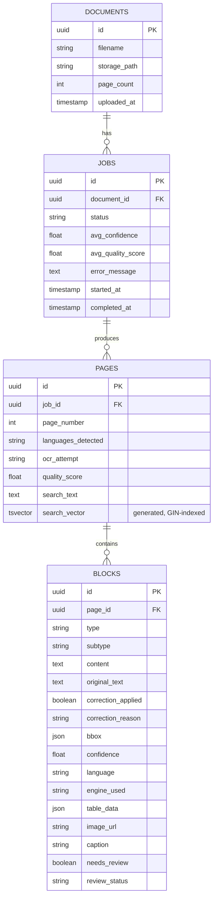
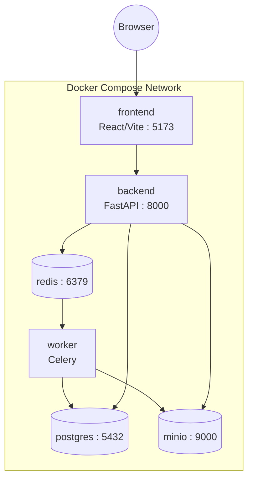

# Multilingual OCR Pipeline — System Architecture

**Project:** DocScribe

> This file describes the system's design: components, data flow, schemas, and contracts. `README.md` covers setup and usage.

---

## 1. Problem Statement

Documents need their textual content extracted reliably so downstream systems (search indexing, data entry automation, compliance checks, analytics) can consume it. Without a robust, language-aware OCR pipeline, multilingual and structurally complex documents fail to process or produce low-quality, unreliable text.

## 2. Solution Overview

An end-to-end, open-source OCR pipeline that:
- Accepts multi-page PDF documents as input
- Produces clean, structured, language-correct extracted text as output
- Is suitable for direct downstream consumption without manual correction

## 3. Design Principles

1. **Open-source first** — no dependency on paid cloud OCR APIs for the core pipeline.
2. **Hybrid engine strategy** — a fast primary OCR engine for the common case, with a layout-aware fallback for hard pages (tables, mixed scripts, low confidence).
3. **Structured output over raw text** — every extraction returns text + layout + confidence + language, not a text blob.
4. **CPU-first, GPU-optional** — the app runs end-to-end without a GPU; a GPU speeds up the fallback path but isn't required.
5. **Downstream-agnostic** — output schema is generic JSON/Markdown so any consumer (search index, RPA bot, compliance scanner) can use it without custom parsing.

---

## 4. OCR Engines

| Engine | Role | Why |
|---|---|---|
| **PaddleOCR** (with a fine-tuned recognition model — see README) | Primary | Fast, CPU-viable, strong multilingual support |
| **Surya** | Fallback | Layout-aware detection + recognition, used selectively for low-confidence pages or pages containing a script the primary model wasn't trained on — not a drop-in recognition swap. Pages that mix only the primary model's own languages (English, Hindi, Marathi, Gujarati) stay on the primary engine. Its own layout detection produces the bboxes for the regions it covers, which is what makes it useful on multi-column pages and complex layouts rather than just a second-opinion recognizer. |

Routing between the two is confidence- and layout-driven (see Section 7).

---

## 5. Tech Stack

| Layer | Choice | Why |
|---|---|---|
| Frontend | React + Vite + Tailwind CSS | Fast dev loop, good for upload/preview UI |
| Backend API | FastAPI (Python) | Async-native, same language as the ML pipeline |
| Job Queue | Celery + Redis | Multi-page PDFs are slow — must not block the request thread |
| OCR | PaddleOCR (primary) + Surya (fallback) | See Section 4 |
| PDF → image | PyMuPDF | Page rasterization |
| Preprocessing | OpenCV | Deskew, denoise |
| Spell correction | SymSpell (offline, per-language dictionaries) | Low-confidence token cleanup, en/hi/gu/mr |
| Relational DB | PostgreSQL | Job metadata, document records |
| Object storage | S3-compatible (MinIO locally) | Original PDFs + extracted outputs |
| Deployment | Docker Compose | Reproducible multi-service local setup |

---

## 6. High-Level System Architecture



---

## 7. Data Flow



---

## 8. Engine Routing Logic



Every page records which attempt produced its accepted output: `ocr_attempt` is one of `original | enhanced | threshold | surya`, persisted on the `pages` row (§10) and exposed via `GET /jobs/{id}/pages/{n}`.

---

## 9. Common Output Schema

Every page/document, regardless of which engine produced it, is normalized into this shape before storage or delivery. **JSON is the canonical/authoritative format; Markdown is always a derived export**, never the source of truth — this matters most for tables and multilingual text, where Markdown alone would be lossy.

### 9.1 Multilingual text policy

- Text is stored **in its original language** per block — no auto-translation during extraction.
- Each block carries its own `language` (ISO 639-1) since a single page or document can mix scripts.
- Translation is opt-in and additive: a block may later gain `translated_text` / `translated_lang` fields, but the original `text` field is never overwritten.

### 9.2 Table policy

- Tables are stored as **structured cell data** (rows/cols/cell text/spans/confidence), not a flat text blob — Markdown can't represent merged cells or per-cell confidence.
- Markdown table export is generated from the `table.cells` array; merged cells are flattened as best-effort for the Markdown view, with JSON remaining authoritative for true structure.

### 9.3 Image / chart policy

- Layout-detected figure regions are cropped from the rasterized page and stored as image files in object storage; the JSON block holds a reference URL, not raw bytes.
- Plain images/diagrams: crop + store + attach nearby caption text if detected adjacent to the bbox.
- Charts/graphs: OCR does **not** attempt to extract underlying data values from a chart — that's a different problem, and guessing is worse than not guessing. Chart regions are flagged `subtype: "chart"` with `needs_review: true`.
- `alt_text` is reserved for a future generated-description field, explicitly labeled as generated, never presented as extracted data.

### 9.4 Post-processing & review routing

Before reading-order sorting and schema assembly, every page's raw block list (text + table + figure) passes through a dedicated post-processing stage (`worker/pipeline/postprocess.py`):

- **Text cleanup** — Unicode (NFC) and whitespace/control-character hygiene on every text-bearing block. This is hygiene, not correction — it never changes wording.
- **Duplicate suppression** — the main text pass runs over the whole page independently of table/figure detection, so a table's cell text and a chart's internal labels can also show up as ordinary heading/paragraph blocks. Any such block whose bbox falls substantially inside a table/figure region is dropped: the table's own cell data already has that text with real structure, and chart-internal text is noise DocScribe never promises to extract (see §9.3).
- **Overlap merge** — a defensive rule that collapses same-type text blocks that heavily overlap and read as near-identical text, independent of the table/figure case above.
- **Confidence-based review routing** — every surviving block gets a `review_status` from its own confidence: `>= 0.90` → `accepted`, `0.75–0.90` → `flagged`, `< 0.75` → `needs_review`. The `needs_review` boolean is derived from this for every block type; figures additionally keep their own stricter rule (confidence + caption match) on top of it.

### 9.5 Post-OCR correction policy

- After normalization, each page's text blocks are corrected via a configurable LLM provider (`worker/pipeline/correction.py`) — **one batched API call per page** (block id + text + language), not per word/block. Replaces an earlier offline SymSpell approach, which had unreliable gu/mr dictionaries; SymSpell remains available behind `CORRECTION_PROVIDER=legacy_symspell` for comparison only.
- Provider + model + timeout/retry budget are set via `CORRECTION_PROVIDER` (`anthropic` | `openai` | `gemini` | `legacy_symspell` | `none`, defaults to `none` — correction is opt-in), `CORRECTION_API_KEY` (env/`.env` only, never committed), `CORRECTION_MODEL`, `CORRECTION_TIMEOUT_SECONDS`, `CORRECTION_MAX_RETRIES` (`backend/app/core/config.py`).
- **Strict system prompt**: fix OCR/spelling errors only — never translate, never change script/language, preserve numbers/dates/names/codes/punctuation/line structure, no added or removed content. Response must be JSON keyed by the same block ids, nothing else.
- **Skip rules**: table cells and figure blocks are never sent for correction (`_SKIP_CORRECTION_TYPES`); blocks at/above `CORRECTION_SKIP_CONFIDENCE` (default 0.98) are left alone.
- **Safety rails**: the response is validated (same block ids present, valid JSON, same script as the input) — any mismatch falls back to the raw OCR text for that block. A correction whose normalized edit distance exceeds `CORRECTION_MAX_EDIT_DISTANCE_RATIO` (default 0.30) is rejected as a rewrite rather than a spell-fix, keeping the raw text instead.
- **Never crashes the pipeline**: any API failure, timeout, rate-limit, or malformed response is caught, logged as a warning, and the page proceeds with raw OCR text — `correct_page_blocks()` always returns a result parallel to its input and never raises.
- Cached in-process by `hash(text, language)`; retried with backoff up to `CORRECTION_MAX_RETRIES`.
- Each block stores `original_text`, `corrected_text` (= `text`), `correction_applied: bool`, and `correction_reason` — review gating no longer applies to a text block once correction has run on it (`needs_review` is forced `false` when `correction_applied` is true). `correction_reason` is one of: `ok` (corrected, or checked and already correct), `skipped_type` (table/figure/empty), `skipped_high_confidence` (≥ `CORRECTION_SKIP_CONFIDENCE`), `cache_hit`, `provider_disabled` (`CORRECTION_PROVIDER=none`), `api_error` (request failed after retries — raw text kept), `invalid_response` (provider omitted this block id), `edit_distance_rejected` (looked like a rewrite, not a fix), or `legacy_symspell`.
- **Privacy**: when an external provider is enabled, OCR'd document text is sent to that provider's API. See README "Privacy" note before enabling for sensitive documents.

#### Gemini rate limiting

Gemini's free tier caps `gemini-3.8-flash` at both a per-minute **and** a per-day request quota (observed directly from the API's own error payloads: `generate_content_free_tier_requests`, 5/min and, separately, `GenerateRequestsPerDayPerProjectPerModel-FreeTier` at 20/day) — far tighter than Anthropic/OpenAI have shown. `GeminiCorrectionProvider` (`worker/pipeline/correction.py`) handles the per-minute case proactively and the per-day case safely, since no client-side logic can fix a daily cap:

1. **Proactive client-side throttle** (`_wait_for_rate_limit()`) — a process-wide rate limiter, shared across every job and page (module-level state, not per-call-site), spaces Gemini calls at least `60 / CORRECTION_RPM` seconds apart (default `CORRECTION_RPM=5` → 12s). Runs before every attempt, success or retry.
2. **Exact-delay 429 handling, with a sanity cap** — on a `429 RESOURCE_EXHAUSTED`, the server's own `google.rpc.RetryInfo.retryDelay` is parsed out of the structured error payload (`_parse_retry_delay_seconds()`) and waited out precisely, rather than a generic exponential backoff that might under- or over-wait relative to what the server actually told us. **But** a per-minute quota's delay is a handful of seconds, while a per-*day* quota's delay can be the time until the next daily reset — observed as high as ~13.5 hours. Blindly sleeping that long inside a worker task (`concurrency=1`) would hang the entire worker for the wait's duration, blocking every other job. So a delay beyond `GEMINI_MAX_HONORED_RETRY_DELAY_SECONDS` (default 60s) is treated as unrecoverable within this job — it falls back to raw text immediately instead of waiting. A capped number of *honored* (short) 429 waits (`_MAX_RATE_LIMIT_WAITS = 3`) still applies on top of that.
3. Waits from (1) and the honored waits in (2) do **not** count against `GEMINI_RETRY_ATTEMPTS` — that budget is reserved for genuine `5xx`/network failures, handled separately with exponential backoff (`GEMINI_RETRY_INITIAL_DELAY_SECONDS` → `GEMINI_RETRY_MAX_DELAY_SECONDS`).

The SDK's own built-in HTTP retry is disabled (`attempts=1` in `HttpOptions.retry_options`) so this manual loop has sole control over every wait. Still one call per page; still falls back to raw OCR text on any unrecovered failure — this only changes *how* a retry-worthy failure is waited out, not the one-call-per-page design or the safety-rail contract above.

### 9.6 OCR quality score

Confidence alone only reflects the OCR engine's self-reported certainty — it says nothing about whether the output is actually usable (garbled characters, a page mostly uncovered by any block, inconsistent language detection can all hide behind a "confident" score). `worker/pipeline/quality.py` computes an explicit, auditable 0–1 score per page from five weighted components:

| Component | Weight (default) | What it measures |
|---|---|---|
| `confidence` | 0.35 | Average OCR engine confidence across the page's text blocks |
| `text_quality` | 0.25 | Share of text blocks the correction step left unchanged (a high share means the raw OCR text was already clean) |
| `character_quality` | 0.15 | Share of characters matching the block's expected script (per `language`) or common punctuation/digits/whitespace — penalizes junk symbols |
| `page_coverage` | 0.15 | Share of page area covered by block bounding boxes (summed, capped at 1.0 — not a true union) |
| `language_consistency` | 0.10 | Share of text blocks matching the page's dominant detected language |

Weights are configurable (`QUALITY_WEIGHT_*` in `config.py`, sum to 1.0) and the score is computed **twice**, at different points with different signal availability:

1. **Early gate** (`router.py`, inside `EngineRouter.process_page()`) — computed on raw PaddleOCR text blocks only, before correction or structure detection have run. `text_quality` is neutral here (no `correction_applied` signal yet) and `page_coverage` only sees text blocks (tables/figures not yet detected). Used alongside `avg_confidence` to decide whether to retry on image variants / fall back to Surya: a page can clear the confidence threshold and still be retried if `quality_score < QUALITY_SCORE_THRESHOLD` (default 0.70).
2. **Final score** (`tasks.py`, after normalization) — computed on the complete page (corrected text + tables + figures), stored as the authoritative value.

Stored per page (`pages.quality_score`) and aggregated per document (`jobs.avg_quality_score`, mean across pages) — exposed via `GET /jobs/{id}`, `GET /jobs/{id}/pages/{n}`, and `GET /documents`, and shown in the frontend document list.

### 9.7 Full-text search

`pages.search_text` holds every block's text on that page, concatenated at persist time (`tasks._persist_pages_and_blocks()`); `pages.search_vector` is a `GENERATED ALWAYS AS (to_tsvector('simple', ...)) STORED` column over it, backed by a GIN index (`idx_pages_search_vector`). `GET /api/v1/search?q=` queries it directly with `plainto_tsquery` + `ts_rank` + `ts_headline`, no application-level indexing service.

**Known limitation**: Postgres's `simple` text-search configuration does no stemming or stopword removal for *any* language — tokenization only. No Postgres built-in configuration supports Devanagari or Gujarati linguistically, so this applies uniformly; search behaves as token matching, not as a linguistically-aware search (an inflected word form won't automatically match its root).

**Snippet rendering**: `ts_headline()` wraps matched terms in the surrounding (untrusted — it's OCR'd document text) snippet. The API uses non-HTML delimiters (`StartSel`/`StopSel` set to `\x01`/`\x02`) rather than `<b>` tags, and the frontend splits on them and renders each segment as plain text + a React element — never `dangerouslySetInnerHTML` — so a document containing literal markup in its OCR'd text can't inject into the search results page.

### 9.8 Derived PDF exports

Three PDF variants are generated per job (`worker/pipeline/export_pdf.py`) alongside JSON/Markdown/TXT, each serving a different purpose:

| Variant | Background | Text layer | Use case |
|---|---|---|---|
| `searchable_pdf` | Original rasterized page image | Invisible (render mode 3), positioned per block bbox | Looks identical to the scan, but searchable/selectable |
| `highlighted_pdf` | Original rasterized page image | Invisible, plus a semi-transparent color rectangle per block keyed to `language`, with a legend | Visual QA of language detection on multilingual pages |
| `structured_pdf` | None (blank page) | Visible, redrawn at each block's position; tables redrawn as a real grid; figures re-embedded from their MinIO crop | A clean reconstruction when the original scan is poor but the extracted structure is good |

All three reuse the same bundled Unicode fonts (`worker/pipeline/fonts/` — Noto Sans / Noto Sans Devanagari / Noto Sans Gujarati) keyed off each block's `language`, matching `_PRIMARY_MODEL_SCRIPTS`. PyMuPDF's `insert_font()` rejects fontnames containing spaces, so each font file is given a fixed sanitized alias (`notosans-deva`/`notosans-gujr`/`notosans-latn`) rather than using `pymupdf.Font(...).name` directly.

```json
{
  "document_id": "uuid",
  "filename": "sample.pdf",
  "page_count": 12,
  "pages": [
    {
      "page_number": 1,
      "language_detected": ["en", "hi"],
      "ocr_attempt": "original | enhanced | threshold | surya",
      "quality_score": 0.91,
      "blocks": [
        {
          "block_id": "p1_b1",
          "type": "heading | paragraph | table | list | caption | figure",
          "text": "Extracted text content",
          "original_text": "Extracted text content (raw OCR)",
          "corrected_text": "Extracted text content",
          "correction_applied": false,
          "bbox": [x0, y0, x1, y1],
          "confidence": 0.97,
          "language": "en",
          "engine_used": "paddleocr | surya",
          "translated_text": null,
          "translated_lang": null,
          "review_status": "accepted",
          "needs_review": false
        },
        {
          "block_id": "p1_b2",
          "type": "table",
          "bbox": [x0, y0, x1, y1],
          "confidence": 0.91,
          "table": {
            "rows": 4,
            "cols": 3,
            "cells": [
              {"row": 0, "col": 0, "row_span": 1, "col_span": 1, "text": "Item", "is_header": true, "confidence": 0.95},
              {"row": 0, "col": 1, "row_span": 1, "col_span": 2, "text": "Details", "is_header": true, "confidence": 0.93}
            ]
          },
          "review_status": "flagged",
          "needs_review": false
        },
        {
          "block_id": "p1_b3",
          "type": "figure",
          "subtype": "image | chart",
          "bbox": [x0, y0, x1, y1],
          "confidence": 0.88,
          "image_url": "minio://results/doc123/p1_b3.png",
          "caption": "Figure 2: Regional sales breakdown",
          "alt_text": null,
          "review_status": "flagged",
          "needs_review": true
        }
      ]
    }
  ],
  "metadata": {
    "processed_at": "2026-08-07T10:00:00Z",
    "avg_confidence": 0.94,
    "low_confidence_pages": [4, 9]
  }
}
```

Markdown output is derived from this same schema (headings → `#`, tables → GFM tables, figures → ``) so both formats stay in sync with JSON as the source of truth.

---

## 10. Database Schema



> `type` distinguishes heading/paragraph/table/list/caption/figure. `table_data`, `image_url`/`caption`/`subtype` are sparse — populated only for their relevant block type. `needs_review` and `review_status` are populated for every block type (§9.4). `content` holds the corrected text (`original_text` holds the pre-correction raw OCR text — see §9.5). `ocr_attempt` and `quality_score` are documented in §8 and §9.6 respectively.

---

## 11. REST API Contract

| Method | Endpoint | Purpose |
|---|---|---|
| `POST` | `/api/v1/jobs` | Upload PDF, create job, returns `job_id` |
| `GET` | `/api/v1/jobs/{job_id}` | Poll job status (`queued`, `processing`, `done`, `failed`) |
| `GET` | `/api/v1/jobs/{job_id}/result?format=json\|markdown\|txt\|searchable_pdf\|highlighted_pdf\|structured_pdf` | Fetch structured output or a derived export |
| `GET` | `/api/v1/jobs/{job_id}/pages/{n}` | Fetch single-page result (with preview image) |
| `POST` | `/api/v1/jobs/{job_id}/reprocess` | Re-run OCR for a document |
| `GET` | `/api/v1/documents` | List uploaded documents (paginated), with latest job status |
| `DELETE` | `/api/v1/documents/{id}` | Remove document, jobs, and stored files |
| `GET` | `/api/v1/search?q=` | Full-text search across OCR'd page content (§9.7) |

---

## 12. Deployment (Docker Compose)



The `backend` (API) and `worker` (Celery) services build from the same source tree but install different dependency sets — the API never loads the ML stack, keeping that image small.

Both services load `env_file: .env` in `docker-compose.yml`, then layer a handful of container-networking overrides on top (`POSTGRES_HOST=postgres` etc. — `.env`'s own values are for host-side, non-Docker runs and resolve to the wrong hostname inside the Docker network). Any setting not in that explicit override list — `CORRECTION_API_KEY`, `CORRECTION_PROVIDER`, `QUALITY_WEIGHT_*`, etc. — comes from `.env` through `env_file` and needs nothing hardcoded in the compose file to reach the container. Changing `.env` only takes effect after the container is recreated (`docker compose up -d <service>`), not a plain `restart`.

---

## 13. Repository Structure

```
ocr-pipeline/
├── ARCHITECTURE.md
├── README.md
├── docker-compose.yml
├── .env.example
├── frontend/
│   └── src/
│       ├── components/          # UploadForm, JobStatus, PagePreview, ResultViewer, DocumentList, SearchBox
│       ├── api/                 # API client
│       └── store/                # state management
├── backend/
│   ├── app/
│   │   ├── main.py               # FastAPI entrypoint
│   │   ├── api/routes/           # jobs.py, documents.py, search.py
│   │   ├── models/               # SQLAlchemy models
│   │   ├── schemas/              # Pydantic schemas
│   │   ├── services/             # storage.py, queue.py
│   │   └── core/                 # config, db session
│   ├── worker/
│   │   ├── tasks.py               # Celery task definitions
│   │   ├── pipeline/
│   │   │   ├── preprocess.py      # rasterize, deskew, denoise, CLAHE/threshold variants
│   │   │   ├── engines/           # paddle_engine.py, surya_engine.py, structure_engine.py
│   │   │   ├── router.py          # engine selection + image-variant retry + quality gate (Section 8)
│   │   │   ├── postprocess.py     # dedup, review routing
│   │   │   ├── normalize.py       # common schema, Markdown/TXT export
│   │   │   ├── correction.py      # API-based post-OCR correction (anthropic/openai/gemini)
│   │   │   ├── quality.py         # OCR quality score (Section 9.6)
│   │   │   ├── export_pdf.py      # searchable/highlighted/structured PDF generation
│   │   │   ├── spellcheck.py      # legacy offline correction (CORRECTION_PROVIDER=legacy_symspell only)
│   │   │   ├── fonts/             # bundled Unicode fonts for PDF export
│   │   │   └── dictionaries/      # per-language frequency dictionaries (legacy_symspell)
│   │   └── celery_app.py
│   ├── requirements-common.txt    # shared deps (API + worker)
│   ├── requirements-api.txt       # API-only deps, no ML stack
│   └── requirements-worker.txt    # worker-only deps
├── model/
│   └── paddle/inference/rec_finetuned/   # deployed fine-tuned recognition model — see README
├── evaluation/
│   ├── recognition/               # synthetic validation images + comparison.csv + summary.csv
│   ├── real_pdf/                  # input/ (real PDFs) and outputs/ (every export format)
│   └── scripts/                   # run_benchmark.py, run_e2e_test.py
└── infra/
    └── postgres/
```

---

## 14. Non-Functional Requirements

- **Reliability:** a failed page must not fail the whole document job — partial results with per-page status.
- **Observability:** structured logs per job/page, average confidence tracked per job.
- **Idempotency:** re-uploading the same file should be safe to reprocess independently.
- **Extensibility:** the engine router is designed to support adding new engines without touching the schema layer.
