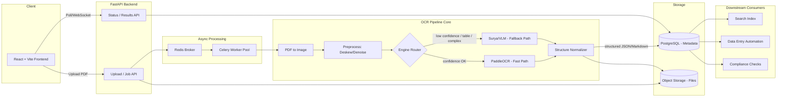
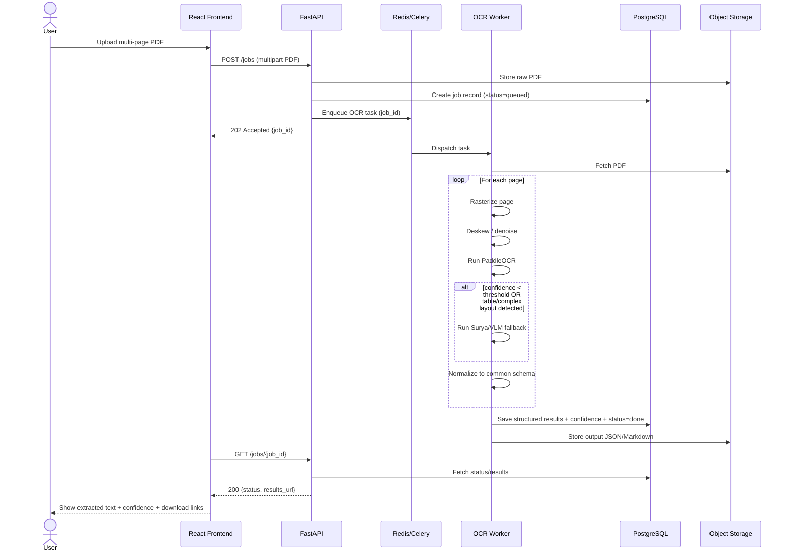
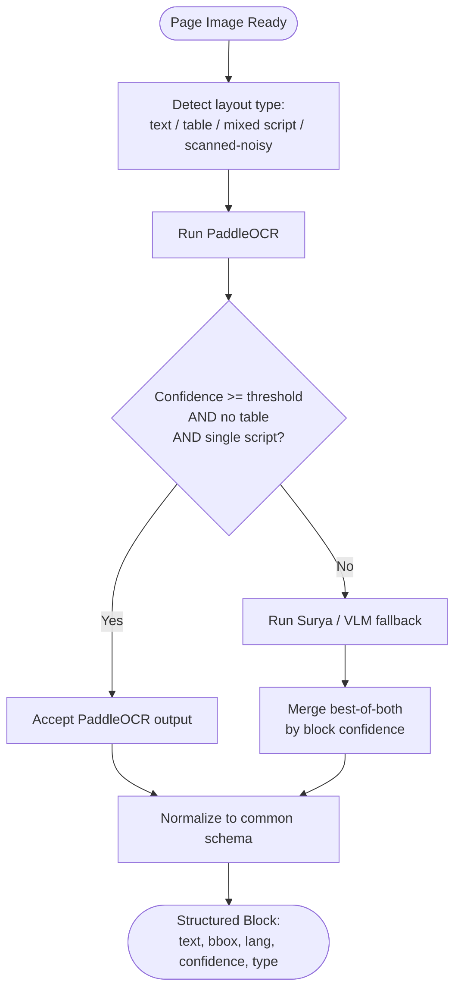
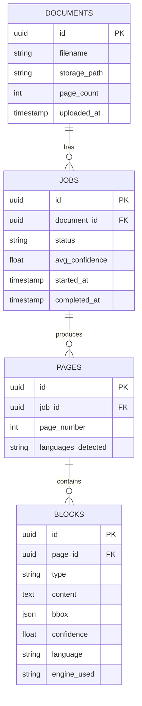
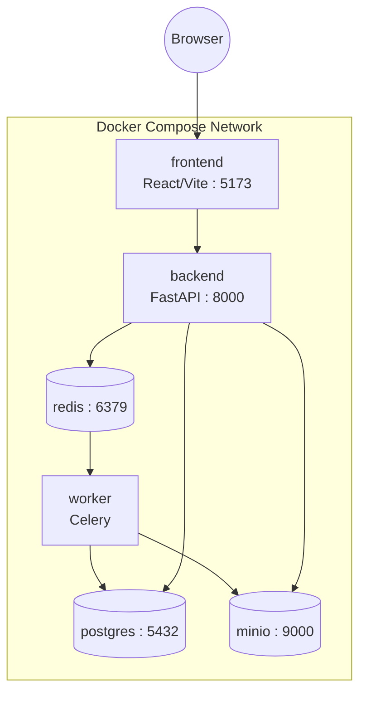

# Multilingual OCR Pipeline — System Architecture

**Project codename:** DocScribe (placeholder — rename as needed)
**Status:** Planning / Base Reference Document
**Last updated:** 2026-08-07

> This file is the single source of truth for the application's design. Every module, decision, and diagram lives here first before code is written. Update this file whenever architecture decisions change.

---

## 1. Problem Statement

Documents need their textual content extracted reliably so downstream systems (search indexing, data entry automation, compliance checks, analytics) can consume it. Without a robust, language-aware OCR pipeline, multilingual and structurally complex documents fail to process or produce low-quality, unreliable text.

## 2. Expected Solution

An end-to-end, open-source OCR pipeline that:
- Accepts multi-page PDF documents as input
- Produces clean, structured, language-correct extracted text as output
- Is suitable for direct downstream consumption without manual correction

## 3. Design Principles

1. **Open-source first** — no dependency on paid cloud OCR APIs for the core pipeline.
2. **Hybrid engine strategy** — fast traditional OCR for the common case, VLM/layout-aware fallback for hard pages (tables, skew, mixed scripts, low confidence).
3. **Structured output over raw text** — every extraction returns text + layout + confidence + language, not a text blob.
4. **CPU-first, GPU-optional** — the app must run end-to-end without a GPU; GPU unlocks the higher-quality fallback path.
5. **Downstream-agnostic** — output schema is generic JSON/Markdown so any consumer (search index, RPA bot, compliance scanner) can use it without custom parsing.

---

## 4. Feature Roadmap

| Phase | Features | Status |
|---|---|---|
| **Phase 0 — MVP** | PDF upload, page-level text extraction, language detection, basic cleanup (dehyphenation, whitespace/encoding fixes), download as .txt/.json | Planned |
| **Phase 1 — Quality & Structure** | Layout-aware extraction (reading order, headings, tables), per-block confidence scoring, Markdown + JSON structured output, async batch processing | Planned |
| **Phase 2 — Multilingual & Robustness** | Multi-script support (Latin, Devanagari, CJK, Arabic/RTL), mixed-language-per-page handling, deskew/denoise preprocessing, traditional→VLM fallback routing | Planned |
| **Phase 3 — Downstream Integration** | REST API for external consumers, webhooks on job completion, PII/compliance field flagging, audit trail | Planned |
| **Phase 4 — Ops & Scale** | Metrics dashboard, human-in-the-loop correction UI, engine versioning/A-B, auth + multi-tenant, rate limiting | Backlog |

---

## 5. OCR Engine Comparison (Cost / Complexity / Accuracy)

Basis for choosing PaddleOCR as primary and Surya as fallback in the routing logic below.

| Engine | Type | License | Params / Footprint | Speed (approx.) | Multilingual | Table/Layout Support | Setup Complexity | Hardware | Best Fit In This Pipeline |
|---|---|---|---|---|---|---|---|---|---|
| **Tesseract** | Traditional CV + LSTM | Apache 2.0 | Lightweight, no GPU needed | ~25 pages/min (CPU) | 100+ languages, weaker on script mixing | Poor — no reliable table/form structure | Low — simple install, minimal deps | CPU only | Cheap baseline / offline fallback, not primary engine |
| **PaddleOCR (PP-OCRv6 + PP-Structure)** | Traditional CV pipeline | Apache 2.0 | Small-to-mid models | ~120 pages/min (GPU, RTX 3090-class); slower on CPU | 80+ languages incl. strong CJK | Good — PP-Structure gives real table extraction | Medium — PaddlePaddle dependency setup is more involved than Tesseract | CPU-viable, GPU recommended for throughput | **Primary engine** — best balance of speed, accuracy, and structure for the bulk of pages |
| **Surya OCR** | VLM-based, layout-native | GPL-3.0 | ~650M params | Slower than Paddle, faster than larger VLMs | Strong, layout-aware across scripts | Strong — layout detection + OCR in one pass | Medium-High — needs PyTorch + model weights, GPU strongly preferred | GPU recommended | **Fallback engine** — routed to for low-confidence, complex-layout, or mixed-script pages |
| **Dots.OCR / DeepSeek-OCR (VLM class)** | Large VLM, layout-native | Open weights (model-specific) | Multi-billion params | Slow, GPU-bound | Very strong, especially mixed/rare scripts | Excellent — native Markdown/JSON structured output | High — `trust_remote_code`, larger GPU memory footprint | GPU required | Reserved for Phase 2+ hardest cases (rare scripts, badly degraded scans) — optional, not in MVP |

**Why this shapes the routing logic (Section 9):** Tesseract is excluded from the live pipeline (kept only as an emergency CPU-only fallback if PaddleOCR isn't available); PaddleOCR handles the majority of pages cheaply; Surya is invoked selectively rather than by default, since it costs more compute per page. The heavier VLMs (Dots.OCR/DeepSeek-OCR) are deferred until there's a clear case volume that justifies their GPU cost.

---

## 6. Tech Stack

| Layer | Choice | Why |
|---|---|---|
| Frontend | React + Vite + Tailwind CSS | Fast dev loop, consistent with existing stack, good for upload/preview UI |
| Backend API | FastAPI (Python) | Async-native, same language as the ML pipeline (no cross-language glue) |
| Job Queue | Celery + Redis | Multi-page PDFs are slow — must not block the request thread |
| Primary OCR engine | PaddleOCR (PP-OCRv6 / PP-Structure) | Fast, CPU-viable, strong multilingual + table support |
| Fallback OCR engine | Surya OCR (or Dots.OCR-class VLM) | Layout-aware, used for low-confidence / complex pages |
| PDF → image | PyMuPDF (fitz) / pdf2image | Reliable page rasterization |
| Preprocessing | OpenCV | Deskew, denoise, binarization |
| Language ID | fastText langid / PaddleOCR built-in | Per-block language tagging |
| Relational DB | PostgreSQL | Job metadata, document records, audit trail |
| Object storage | S3-compatible (MinIO locally, S3 in prod) | Original PDFs + extracted outputs |
| Search (Phase 3) | OpenSearch / Elasticsearch | Downstream search-indexing consumer |
| Deployment | Docker Compose (dev) → container orchestration (prod, later) | Reproducible multi-service setup |

---

## 7. High-Level System Architecture



---

## 8. Data Flow (Sequence Diagram)



---

## 9. Engine Routing Logic



---

## 10. Common Output Schema

Every page/document, regardless of which engine produced it, is normalized into this shape before storage or delivery:

```json
{
  "document_id": "uuid",
  "filename": "sample.pdf",
  "page_count": 12,
  "pages": [
    {
      "page_number": 1,
      "language_detected": ["en", "hi"],
      "blocks": [
        {
          "block_id": "p1_b1",
          "type": "heading | paragraph | table | list | caption",
          "text": "Extracted text content",
          "bbox": [x0, y0, x1, y1],
          "confidence": 0.97,
          "language": "en",
          "engine_used": "paddleocr | surya"
        }
      ]
    }
  ],
  "metadata": {
    "processed_at": "2026-08-07T10:00:00Z",
    "avg_confidence": 0.94,
    "low_confidence_pages": [4, 9]
  }
}
```

Markdown output is derived from this same schema (headings → `#`, tables → Markdown tables, etc.) so both formats stay in sync.

---

## 11. Database Schema (ER Diagram)



---

## 12. REST API Contract (draft)

| Method | Endpoint | Purpose |
|---|---|---|
| `POST` | `/api/v1/jobs` | Upload PDF, create job, returns `job_id` |
| `GET` | `/api/v1/jobs/{job_id}` | Poll job status (`queued`, `processing`, `done`, `failed`) |
| `GET` | `/api/v1/jobs/{job_id}/result?format=json\|markdown` | Fetch structured output |
| `GET` | `/api/v1/jobs/{job_id}/pages/{n}` | Fetch single-page result (with preview image) |
| `POST` | `/api/v1/jobs/{job_id}/reprocess` | Re-run with different engine/settings |
| `GET` | `/api/v1/documents` | List uploaded documents (paginated) |
| `DELETE` | `/api/v1/documents/{id}` | Remove document + associated jobs |
| `POST` | `/api/v1/webhooks` *(Phase 3)* | Register a callback URL for job completion |

---

## 13. Deployment Diagram (Docker Compose — Dev/Demo)



GPU note: if the Surya/VLM fallback is enabled, the `worker` service needs CUDA runtime access (or is split into a separate `gpu-worker` service pinned to a GPU-enabled host, with the CPU worker still handling the PaddleOCR fast path).

---

## 14. Repository / Folder Structure

```
ocr-pipeline/
├── ARCHITECTURE.md              # this file
├── docker-compose.yml
├── frontend/
│   ├── src/
│   │   ├── components/          # UploadForm, JobStatus, PagePreview, ResultViewer
│   │   ├── pages/
│   │   ├── api/                 # API client
│   │   └── store/                # state management
│   └── package.json
├── backend/
│   ├── app/
│   │   ├── main.py               # FastAPI entrypoint
│   │   ├── api/routes/           # jobs.py, documents.py, webhooks.py
│   │   ├── models/               # SQLAlchemy models
│   │   ├── schemas/              # Pydantic schemas (matches Section 9)
│   │   ├── services/             # storage.py, queue.py
│   │   └── core/                 # config, db session
│   ├── worker/
│   │   ├── tasks.py               # Celery task definitions
│   │   ├── pipeline/
│   │   │   ├── preprocess.py      # deskew, denoise
│   │   │   ├── engines/
│   │   │   │   ├── paddle_engine.py
│   │   │   │   └── surya_engine.py
│   │   │   ├── router.py          # engine selection logic (Section 9)
│   │   │   └── normalize.py       # common schema output
│   │   └── celery_app.py
│   ├── tests/
│   └── requirements.txt
└── infra/
    ├── minio/
    └── postgres/
```

---

## 15. Non-Functional Requirements

- **Reliability:** failed pages must not fail the whole document job — partial results with per-page status.
- **Observability:** structured logs per job/page, average confidence tracked over time.
- **Idempotency:** re-uploading the same file (hash match) should reuse cached results by default.
- **Data retention:** raw PDFs and outputs retained per a configurable policy (relevant for compliance use cases).
- **Extensibility:** engine router must support adding new engines (e.g., Dots.OCR, DeepSeek-OCR) without touching the schema layer.

---

## 16. Open Decisions (to revisit)

- [ ] Target script set for Phase 2 (Indian regional scripts vs. broader multilingual)
- [ ] GPU availability for VLM fallback — local, Colab, or cloud
- [ ] Deployment target: hackathon demo only vs. long-term hosted service
- [ ] Human-in-the-loop correction UI — in scope for Phase 4 or dropped

---

## 17. Change Log

| Date | Change |
|---|---|
| 2026-08-07 | Initial architecture document created |
| 2026-08-07 | Added OCR engine cost/complexity/accuracy comparison table (Section 5) |
