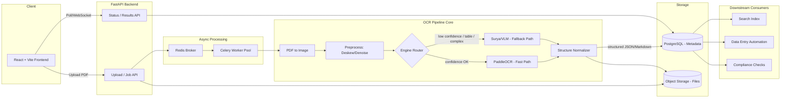
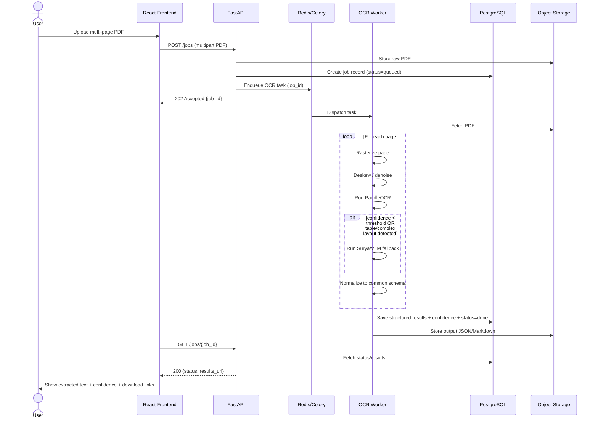
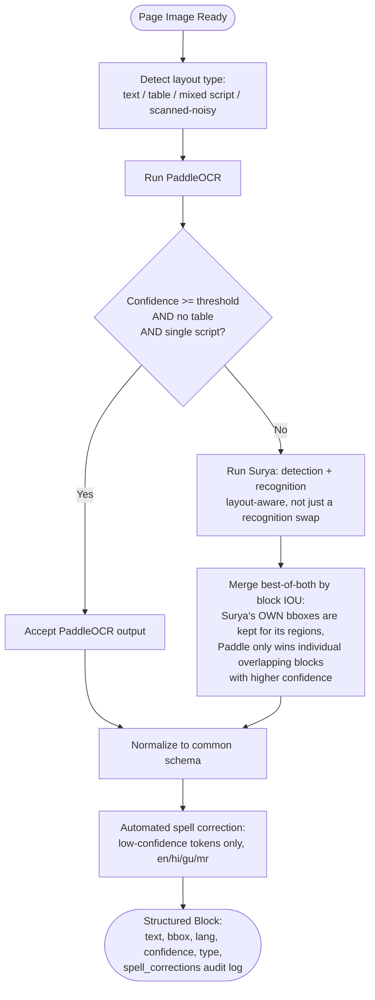
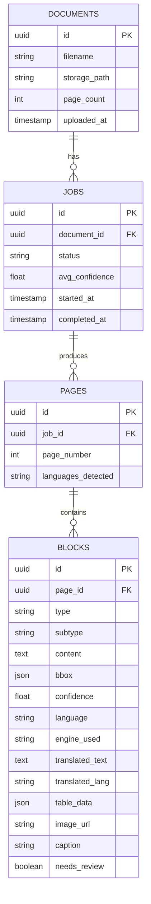
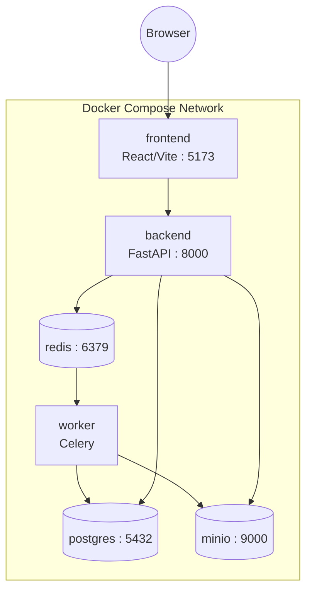

# Multilingual OCR Pipeline — System Architecture

**Project codename:** DocScribe (placeholder — rename as needed)
**Status:** Phase 0 (MVP) closed — verified running end-to-end; Phase 1 (Quality & Structure) closed — all 8 items done and verified, including browser click-through (confirmed by user)
**Last updated:** 2026-09-16 (evening)

> This file is the single source of truth for the application's design. Every module, decision, and diagram lives here first before code is written. Update this file whenever architecture decisions change.

---

## 1. Problem Statement

Documents need their textual content extracted reliably so downstream systems (search indexing, data entry automation, compliance checks, analytics) can consume it. Without a robust, language-aware OCR pipeline, multilingual and structurally complex documents fail to process or produce low-quality, unreliable text.

## 2. Expected Solution

An end-to-end, open-source OCR pipeline that:
- Accepts multi-page PDF documents as input
- Produces clean, structured, language-correct extracted text as output
- Is suitable for direct downstream consumption without manual correction

## 3. Design Principles

1. **Open-source first** — no dependency on paid cloud OCR APIs for the core pipeline.
2. **Hybrid engine strategy** — fast traditional OCR for the common case, VLM/layout-aware fallback for hard pages (tables, skew, mixed scripts, low confidence).
3. **Structured output over raw text** — every extraction returns text + layout + confidence + language, not a text blob.
4. **CPU-first, GPU-optional** — the app must run end-to-end without a GPU; GPU unlocks the higher-quality fallback path.
5. **Downstream-agnostic** — output schema is generic JSON/Markdown so any consumer (search index, RPA bot, compliance scanner) can use it without custom parsing.

---

## 4. Feature Roadmap

Full checklist-level tracking lives in [`FEATURE_ROADMAP.md`](./FEATURE_ROADMAP.md) — keep that file updated as items ship. Summary:

| Phase | Features | Status |
|---|---|---|
| **Phase 0 — MVP** | PDF upload, page-level text extraction, language detection, basic cleanup (dehyphenation, whitespace/encoding fixes), download as .txt/.json | Closed |
| **Phase 1 — Quality & Structure** | Layout-aware extraction (reading order, headings, tables), per-block confidence scoring, Markdown + JSON structured output, async batch processing | Closed (8/8 items) |
| **Phase 2 — Multilingual & Robustness** | Multi-script support (Latin, Devanagari, CJK, Arabic/RTL), mixed-language-per-page handling, deskew/denoise preprocessing, traditional→VLM fallback routing | Planned |
| **Phase 3 — Downstream Integration** | REST API for external consumers, webhooks on job completion, PII/compliance field flagging, audit trail | Planned |
| **Phase 4 — Ops & Scale** | Metrics dashboard, human-in-the-loop correction UI, engine versioning/A-B, auth + multi-tenant, rate limiting | Backlog |

---

## 5. OCR Engine Comparison (Cost / Complexity / Accuracy)

Basis for choosing PaddleOCR as primary and Surya as fallback in the routing logic below.

| Engine | Type | License | Params / Footprint | Speed (approx.) | Multilingual | Table/Layout Support | Setup Complexity | Hardware | Best Fit In This Pipeline |
|---|---|---|---|---|---|---|---|---|---|
| **Tesseract** | Traditional CV + LSTM | Apache 2.0 | Lightweight, no GPU needed | ~25 pages/min (CPU) | 100+ languages, weaker on script mixing | Poor — no reliable table/form structure | Low — simple install, minimal deps | CPU only | Cheap baseline / offline fallback, not primary engine |
| **PaddleOCR (PP-OCRv6 + PP-Structure)** | Traditional CV pipeline | Apache 2.0 | Small-to-mid models | ~120 pages/min (GPU, RTX 3090-class); slower on CPU | 80+ languages incl. strong CJK | Good — PP-Structure gives real table extraction | Medium — PaddlePaddle dependency setup is more involved than Tesseract | CPU-viable, GPU recommended for throughput | **Primary engine** — best balance of speed, accuracy, and structure for the bulk of pages |
| **Surya OCR** | VLM-based, layout-native | GPL-3.0 | ~650M params | Slower than Paddle, faster than larger VLMs | Strong, layout-aware across scripts | Strong — layout detection + OCR in one pass | Medium-High — needs PyTorch + model weights, GPU strongly preferred | GPU recommended | **Fallback engine** — routed to for low-confidence, complex-layout, or mixed-script pages. Pinned to `surya-ocr==0.17.1`: releases ≥0.20.0 replaced the plain-PyTorch API with a `SuryaInferenceManager` that mandates a separate vllm (NVIDIA GPU) or llama.cpp inference server — too heavy for this CPU-first Docker Compose setup, so we stay on the last pre-overhaul release. |
| **Dots.OCR / DeepSeek-OCR (VLM class)** | Large VLM, layout-native | Open weights (model-specific) | Multi-billion params | Slow, GPU-bound | Very strong, especially mixed/rare scripts | Excellent — native Markdown/JSON structured output | High — `trust_remote_code`, larger GPU memory footprint | GPU required | Reserved for Phase 2+ hardest cases (rare scripts, badly degraded scans) — optional, not in MVP |

**Why this shapes the routing logic (Section 9):** Tesseract is excluded from the live pipeline (kept only as an emergency CPU-only fallback if PaddleOCR isn't available); PaddleOCR handles the majority of pages cheaply; Surya is invoked selectively rather than by default, since it costs more compute per page. The heavier VLMs (Dots.OCR/DeepSeek-OCR) are deferred until there's a clear case volume that justifies their GPU cost.

---

## 6. Tech Stack

| Layer | Choice | Why |
|---|---|---|
| Frontend | React + Vite + Tailwind CSS | Fast dev loop, consistent with existing stack, good for upload/preview UI |
| Backend API | FastAPI (Python) | Async-native, same language as the ML pipeline (no cross-language glue) |
| Job Queue | Celery + Redis | Multi-page PDFs are slow — must not block the request thread |
| Primary OCR engine | PaddleOCR (PP-OCRv6 / PP-Structure) | Fast, CPU-viable, strong multilingual + table support |
| Fallback OCR engine | Surya OCR (or Dots.OCR-class VLM) | Layout-aware, used for low-confidence / complex pages |
| PDF → image | PyMuPDF (fitz) / pdf2image | Reliable page rasterization |
| Preprocessing | OpenCV | Deskew, denoise, binarization |
| Language ID | fastText langid / PaddleOCR built-in | Per-block language tagging |
| Relational DB | PostgreSQL | Job metadata, document records, audit trail |
| Object storage | S3-compatible (MinIO locally, S3 in prod) | Original PDFs + extracted outputs |
| Search (Phase 3) | OpenSearch / Elasticsearch | Downstream search-indexing consumer |
| Deployment | Docker Compose (dev) → container orchestration (prod, later) | Reproducible multi-service setup |

---

## 7. High-Level System Architecture



---

## 8. Data Flow (Sequence Diagram)



---

## 9. Engine Routing Logic



Surya is a **structure-aware fallback**, not a drop-in recognition swap: its own `DetectionPredictor` produces the bboxes for the regions it covers, and `EngineRouter._merge_blocks()` (`backend/worker/pipeline/router.py`) keeps those boxes rather than pasting Surya's text into PaddleOCR's (possibly wrong) geometry. That distinction is what makes the fallback actually useful on multi-column pages, tables, and rotated/skewed scans, rather than a checkbox confidence threshold.

---

## 10. Common Output Schema

Every page/document, regardless of which engine produced it, is normalized into this shape before storage or delivery. **JSON is the canonical/authoritative format; Markdown is always a derived export**, never the source of truth — this matters most for tables and multilingual text, where Markdown alone would be lossy.

### 10.1 Multilingual text policy

- Text is stored **in its original language** per block — no auto-translation to English during extraction. Compliance and audit use cases require the source text to be preserved exactly as it appeared.
- Each block carries its own `language` (ISO 639-1) since a single page or document can mix scripts.
- Translation is **opt-in and additive**, never destructive: a block may later gain `translated_text` / `translated_lang` fields populated by a separate downstream step (Phase 3+), but the original `text` field is never overwritten.
- Downstream search indexing uses per-language analyzers (OpenSearch/Elasticsearch) keyed off the `language` field, rather than requiring translation to be searchable.

### 10.2 Table policy

- Tables are stored as **structured cell data** (rows/cols/cell text/spans/confidence), not as a flat text blob or a Markdown table at the source-of-truth layer — Markdown can't represent merged cells or per-cell confidence.
- Markdown table export is generated by walking the `table.cells` array; merged cells are flattened as best-effort for the Markdown view, with a note that JSON is authoritative for anything needing true structure.

### 10.3 Image / chart policy

- Layout-detected figure regions are **cropped from the rasterized page and stored as image files in object storage**; the JSON block holds a reference URL, not raw bytes.
- Plain images/diagrams: crop + store + attach nearby caption text if detected adjacent to the bbox.
- Charts/graphs: OCR does **not** attempt to extract underlying data values from a chart (that's chart understanding, a different problem, and guessing is worse than not guessing — especially for compliance use). Chart regions are flagged `subtype: "chart"` with `needs_review: true`.
- Optional Phase 2+: a VLM-generated `alt_text` description for search/accessibility, explicitly labeled as *generated*, never presented as extracted data.

### 10.4 Spell-correction policy

- After normalization, each text block passes through automated, offline spell correction (`backend/worker/pipeline/spellcheck.py`, SymSpell-based) — but **only** for tokens where OCR confidence is below 0.90, and only for languages with a loaded frequency dictionary (currently `en`, `hi` — see the known-gaps note below). Numerics and alphanumeric IDs are never touched, protecting invoice numbers, dates, and codes.
- Every correction is recorded on the block as `spell_corrections: [{original, corrected, edit_distance}]` — an empty list means nothing was changed, not that correction didn't run. This is the audit trail for the "we auto-corrected X" claim.
- **Resolved:** the dictionary source (hermitdave/FrequencyWords) has no Gujarati or Marathi wordlists at all (confirmed 404) — resolved via the Leipzig Corpora Collection instead (`guj_wikipedia_2021_100K`/`mar_wikipedia_2021_100K`, converted to the same `word count` format, 184,172/162,970 entries after excluding multi-word phrase entries that don't belong in a unigram dictionary — see `spellcheck.py`'s module docstring and the changelog below). All 4 of `en`/`hi`/`gu`/`mr` are now live and verified against real text. `en`/`hi`/`gu`/`mr` dictionaries are all subtitle- or Wikipedia-derived (colloquial/encyclopedic), so domain vocabulary (invoice/legal/medical terms) won't be recognized even for the active languages — flag this to reviewers rather than presenting corrections as domain-validated. Separately: `gu`/`mr` use per-token correction only (not the compound split/merge correction `en`/`hi` get) — see `_COMPOUND_UNSAFE_LANGS` in `spellcheck.py` and the changelog for why.

```json
{
  "document_id": "uuid",
  "filename": "sample.pdf",
  "page_count": 12,
  "pages": [
    {
      "page_number": 1,
      "language_detected": ["en", "hi"],
      "blocks": [
        {
          "block_id": "p1_b1",
          "type": "heading | paragraph | table | list | caption | figure",
          "text": "Extracted text content",
          "bbox": [x0, y0, x1, y1],
          "confidence": 0.97,
          "language": "en",
          "engine_used": "paddleocr | surya",
          "translated_text": null,
          "translated_lang": null,
          "spell_corrections": []
        },
        {
          "block_id": "p1_b2",
          "type": "table",
          "bbox": [x0, y0, x1, y1],
          "confidence": 0.91,
          "table": {
            "rows": 4,
            "cols": 3,
            "cells": [
              {"row": 0, "col": 0, "row_span": 1, "col_span": 1, "text": "Item", "is_header": true, "confidence": 0.95},
              {"row": 0, "col": 1, "row_span": 1, "col_span": 2, "text": "Details", "is_header": true, "confidence": 0.93}
            ]
          }
        },
        {
          "block_id": "p1_b3",
          "type": "figure",
          "subtype": "image | chart",
          "bbox": [x0, y0, x1, y1],
          "confidence": 0.88,
          "image_url": "minio://results/doc123/p1_b3.png",
          "caption": "Figure 2: Regional sales breakdown",
          "alt_text": null,
          "needs_review": true
        }
      ]
    }
  ],
  "metadata": {
    "processed_at": "2026-08-07T10:00:00Z",
    "avg_confidence": 0.94,
    "low_confidence_pages": [4, 9]
  }
}
```

Markdown output is derived from this same schema (headings → `#`, tables → best-effort Markdown tables, figures → ``, etc.) so both formats stay in sync with JSON as the source of truth.

---

## 11. Database Schema (ER Diagram)



> `type` distinguishes heading/paragraph/table/list/caption/figure. `table_data` (rows/cols/cells) is only populated for `type=table`; `image_url`/`caption`/`needs_review`/`subtype` only for `type=figure`. Sparse columns are acceptable here since block volume per page is small — a separate `TABLE_CELLS` child table is a reasonable normalization if table volume grows large (see Section 16 open decisions).

---

## 12. REST API Contract (draft)

| Method | Endpoint | Purpose |
|---|---|---|
| `POST` | `/api/v1/jobs` | Upload PDF, create job, returns `job_id` |
| `GET` | `/api/v1/jobs/{job_id}` | Poll job status (`queued`, `processing`, `done`, `failed`) |
| `GET` | `/api/v1/jobs/{job_id}/result?format=json\|markdown` | Fetch structured output |
| `GET` | `/api/v1/jobs/{job_id}/pages/{n}` | Fetch single-page result (with preview image) |
| `POST` | `/api/v1/jobs/{job_id}/reprocess` | Re-run with different engine/settings |
| `GET` | `/api/v1/documents` | List uploaded documents (paginated) |
| `DELETE` | `/api/v1/documents/{id}` | Remove document + associated jobs |
| `POST` | `/api/v1/webhooks` *(Phase 3)* | Register a callback URL for job completion |

---

## 13. Deployment Diagram (Docker Compose — Dev/Demo)



GPU note: if the Surya/VLM fallback is enabled, the `worker` service needs CUDA runtime access (or is split into a separate `gpu-worker` service pinned to a GPU-enabled host, with the CPU worker still handling the PaddleOCR fast path).

---

## 14. Repository / Folder Structure

```
ocr-pipeline/
├── ARCHITECTURE.md              # this file
├── docker-compose.yml
├── frontend/
│   ├── src/
│   │   ├── components/          # UploadForm, JobStatus, PagePreview, ResultViewer
│   │   ├── pages/
│   │   ├── api/                 # API client
│   │   └── store/                # state management
│   └── package.json
├── backend/
│   ├── app/
│   │   ├── main.py               # FastAPI entrypoint
│   │   ├── api/routes/           # jobs.py, documents.py, webhooks.py
│   │   ├── models/               # SQLAlchemy models
│   │   ├── schemas/              # Pydantic schemas (matches Section 9)
│   │   ├── services/             # storage.py, queue.py
│   │   └── core/                 # config, db session
│   ├── worker/
│   │   ├── tasks.py               # Celery task definitions
│   │   ├── pipeline/
│   │   │   ├── preprocess.py      # deskew, denoise
│   │   │   ├── engines/
│   │   │   │   ├── paddle_engine.py
│   │   │   │   └── surya_engine.py
│   │   │   ├── router.py          # engine selection logic (Section 9)
│   │   │   └── normalize.py       # common schema output
│   │   └── celery_app.py
│   ├── tests/
│   ├── requirements-common.txt  # shared deps (API + worker)
│   ├── requirements-api.txt     # API-only deps, no ML stack
│   └── requirements-worker.txt  # worker-only deps (paddleocr/surya/transformers/opencv)
└── infra/
    ├── minio/
    └── postgres/
```

---

## 15. Non-Functional Requirements

- **Reliability:** failed pages must not fail the whole document job — partial results with per-page status.
- **Observability:** structured logs per job/page, average confidence tracked over time.
- **Idempotency:** re-uploading the same file (hash match) should reuse cached results by default.
- **Data retention:** raw PDFs and outputs retained per a configurable policy (relevant for compliance use cases).
- **Extensibility:** engine router must support adding new engines (e.g., Dots.OCR, DeepSeek-OCR) without touching the schema layer.

---

## 16. Open Decisions (to revisit)

- [ ] Target script set for Phase 2 (Indian regional scripts vs. broader multilingual)
- [ ] GPU availability for VLM fallback — local, Colab, or cloud
- [ ] Deployment target: hackathon demo only vs. long-term hosted service
- [ ] Human-in-the-loop correction UI — in scope for Phase 4 or dropped

---

## 17. Change Log

| Date | Change |
|---|---|
| 2026-08-07 | Initial architecture document created |
| 2026-08-07 | Added OCR engine cost/complexity/accuracy comparison table (Section 5) |
| 2026-08-30 | Locked multilingual (no auto-translation), table (structured JSON, Markdown derived), and image/chart (crop+store, no chart-value guessing) policies in Section 10; updated BLOCKS entity accordingly |
| 2026-08-30 | Extracted Section 4 detail into standalone `FEATURE_ROADMAP.md`; Section 4 now links to it |
| 2026-09-13 | Implemented real Surya fallback engine (detection + recognition, pinned to `surya-ocr==0.17.1` — see §5/§9 for why), wired automated spell correction into the normalize stage (§10.4), fixed the `/jobs/{id}/result`, `/jobs/{id}/pages/{n}`, `/jobs/{id}/reprocess`, `GET /documents`, `DELETE /documents/{id}` stubs to read/write real DB + MinIO state, added page-preview image upload. Fine-tuned PP-OCRv6 recognition model wiring still blocked on exporting `model/paddle/best_model/` (raw training checkpoint, not a PaddleOCR-loadable inference export) and locating the training `dict.txt`. |
| 2026-09-16 | **Phase 0 (MVP) closed.** `model/paddle/best_model/` export path resolved — fine-tuned PP-OCRv6 confirmed loading and extracting real text (39 blocks on `sample.pdf`). Fixed a `transformers>=5.0.0` incompatibility with `surya-ocr==0.17.1` (pinned `transformers>=4.37.0,<5.0.0`) that was crashing Surya via `SuryaDecoderConfig`/`pad_token_id`; added try/except hardening in `router.py` and `surya_engine.py` so a Surya failure can no longer zero out a good Paddle result — this was the root cause of the `avg_confidence` bug (a Surya crash returned a sentinel `{"confidence": 0.0}` block that dragged the page average down even though Paddle succeeded; confirmed fixed, `avg_confidence = 0.9527`). Also fixed `/result` serving stale placeholder data (`filename: "placeholder.pdf"`) — root cause was a stale Docker image from a `COPY . .` BuildKit cache hit, not a code bug; resolved via `docker compose build --no-cache backend`. Two separate cache-hit incidents this phase reinforce: **verify a container is running current source after any build** (grep for a unique string from the latest change inside the running container), not just "build succeeded." Spell-check (`en`/`hi`) confirmed wired into `normalize.py`. Phase 1 (Quality & Structure) started next — see `FEATURE_ROADMAP.md`. |
| 2026-09-16 (later) | **Phase 1 item 2 done (model loading singleton + named Docker volumes).** Confirmed `PaddleOCREngine`/`SuryaOCREngine` were already lazy singletons reused across Celery tasks via `tasks.py`'s module-level `_router` (no per-task re-instantiation). Confirmed `router.py`'s Surya trigger fires only on low-confidence/table/mixed-script, not unconditionally, and its try/except hardening is intact. Split `backend/requirements.txt` into `requirements-common.txt` + `requirements-api.txt` (backend) + `requirements-worker.txt` (worker) with a build-arg-selected `Dockerfile`, confirming the backend image never imports `worker.tasks` (Celery's `include=` list is only evaluated inside `worker_main()`, not on `send_task()`) — verified `backend` image dropped to 1.28GB with zero torch/paddle/surya packages, vs `worker`'s 12GB full ML stack. Converted worker's model caches from bind mounts to named volumes — and in doing so found `~/.paddleocr` was a dead mount (PaddleOCR 3.x/PaddleX actually caches under `~/.paddlex/official_models`, confirmed via `docker exec`), so the volumes are `paddlex_cache`, `hf_cache`, `torch_cache`. Verified persistence across a full `docker compose down && up -d worker`: first run showed `Fetching 5 files`/`checking connectivity` for `PP-OCRv6_medium_det`; second run after recreation showed only `Creating model` with no fetch/download lines. `hf_cache`/`torch_cache` (Surya's weights) weren't exercised in this test — Surya was never reached because of the rec-model regression noted below. |
| 2026-09-16 (later) | **Regression found, NOT yet fixed:** live testing during Phase 1 item 2 shows the fine-tuned rec model load reported fixed earlier today is broken again — `docker-compose.yml`'s `PADDLEOCR_REC_MODEL_DIR` mount (`./model/paddle/inference/rec_finetuned`) no longer exists on disk. Filesystem timestamps show `model/paddle/` was restructured today at 13:22 (before this session started at ~14:26) — the previously-working PaddleX export (with `inference.json`, matching what `paddle_engine.py`'s comments describe as the expected format) now sits at `model/paddle_old/inference/rec_finetuned/`, while the new `model/paddle/inference/` holds a differently-shaped export (`inference.pdmodel` instead of `inference.json`) directly, not under a `rec_finetuned` subdirectory. Every OCR job currently fails page processing with `FileNotFoundError: .../rec_finetuned/inference.yml` and returns `avg_confidence: 0.0`. Not caused by, or fixed as part of, the Phase 1 item 2 work (engine singleton audit / named volumes / requirements split) — flagged here rather than guessed at, since fixing it requires knowing which export is the intended current one. Needs follow-up: either point `PADDLEOCR_REC_MODEL_DIR` at `model/paddle_old/inference/rec_finetuned` (if that's still the intended checkpoint) or re-export `model/paddle/` correctly into a `rec_finetuned` subdirectory. |
| 2026-09-16 (Step 0 fix) | **Fixed** — repointed `docker-compose.yml`'s worker mount from `./model/paddle/inference/rec_finetuned` to `./model/paddle_old/inference/rec_finetuned` (the intact, correctly-shaped export). No files moved or deleted on disk — only the compose mount source changed, to avoid any further risk to `model/paddle/`. Verified end-to-end: reprocessed `sample.pdf`, job completed with `avg_confidence: 0.9527` (real value, not the `0.0` sentinel). `model/paddle/inference/`'s lost flat-format files remain unrecovered — if a fresh checkpoint export is done later, it must land under a `rec_finetuned/` subdirectory to match this mount path, or the mount must be updated again. |
| 2026-09-16 (Phase 1 items 3-8) | **Reading order (item 3):** rewrote `normalize.sort_reading_order()` — column-cluster by x-overlap (threshold 0.5), sort each column top-to-bottom by y0, concatenate columns left-to-right; single-column pages get identical output to the old naive sort (no regression). Checked PP-StructureV3's native layout-parsing reading order first per the task's instruction, but it re-runs text detection *and* recognition on top of layout detection — prohibitively slow on this CPU-only deployment for a page that already went through PaddleOCR/Surya once — so the geometry-only heuristic was used instead (zero extra model inference cost). Verified against a synthetic 2-column PDF: blocks came back in correct Alpha-1..4-then-Beta-1..4 order, `avg_confidence: 0.9995`. **While verifying this, found and fixed an unrelated, more serious pre-existing bug**: `preprocess.deskew_image()`'s minAreaRect angle normalization only handled the negative-angle case; OpenCV 4.10.0 (the version actually installed, vs. 5.0.0 used to write the original code) can return `+90°` for a perfectly axis-aligned page, which the old code passed straight through as a real skew — silently rotating pages 90° that were never skewed at all (this is what caused `sample.pdf`'s "correcting skew of 90.00°" log throughout Phase 0). Fixed with a symmetric angle-normalization guard; confirmed via direct `deskew_image()` call that the same test page now comes back pixel-identical to the input. |
| 2026-09-16 (Phase 1 items 3-8, cont.) | **Tables (item 4) + figures/charts (item 5):** added `worker/pipeline/engines/structure_engine.py` wrapping PaddleX's `TableRecognitionPipelineV2`, run once per page alongside the existing Paddle/Surya text pass (additive, never blocks it — own try/except returns empty results on failure). One `predict()` call yields both `table_res_list` (table cell boxes + per-cell OCR + a predicted HTML structure, reusing the fine-tuned rec model) and `layout_det_res` (full-page layout boxes/labels from PP-DocLayout-L — `table`, `chart`, `image`, `*_title`, etc., confirmed via direct probing, not guessed), so a separate LayoutDetection pass wasn't needed. Table HTML is parsed with BeautifulSoup into the exact `table.{rows,cols,cells}` schema (§10.2) including rowspan/colspan; `is_header` uses a `<th>`-or-row-0 heuristic since this pipeline version never emits `<th>`. Figure/chart crops are cut from the same preprocessed image OCR ran on (so bboxes line up), stashed as `_crop_bytes` on the raw block since MinIO upload needs the real `block_id` that only exists after `normalize.py` assigns it — `tasks._upload_figure_crops()` runs as a post-normalize pass, uploads to `results/{job_id}/{block_id}.png`, sets `image_url`, and strips the internal key before persistence/serialization. Caption matching (§10.3) searches the main OCR text blocks (not the table pipeline's own OCR) for `/^(Figure\|Fig\.\|Table)\s*\d+/i` within 80px vertically of the figure, requiring horizontal overlap. `convert_to_markdown()` now emits GFM tables (merged cells repeated at every spanned position, per §10.2's documented convention) and `` for figures. New dependency: `paddlex[ocr]==3.7.2` (added to `requirements-worker.txt`) — `TableRecognitionPipelineV2`/`LayoutDetection` raise `DependencyError` without it; confirmed lightweight (scipy/scikit-learn/lxml/beautifulsoup4, no torch/CUDA duplication). Hit and fixed three real bugs getting this working: (1) the same MKL-DNN oneDNN crash documented in `paddle_engine.py` also hits `TableRecognitionPipelineV2` — needs `enable_mkldnn=False` there too; (2) the pipeline's default OCR model name doesn't match our fine-tuned checkpoint's config, needs both `text_recognition_model_name="PP-OCRv6_medium_rec"` *and* `text_recognition_model_dir` passed together (matching `paddle_engine.py`'s existing pattern); (3) `table_ocr_pred["rec_scores"]` comes back as a numpy ndarray, and `ndarray or []` raises "truth value of an array is ambiguous" for multi-element arrays — needed an explicit `is None` check. Verified end-to-end via the real API against a synthetic table+chart PDF: table block came back with correct 4×3 structure, header row flagged, per-cell confidence; figure block came back with `subtype: "chart"`, a real 17KB PNG confirmed present in MinIO via `head_object`, `needs_review: true` (correctly, since the caption text was too OCR-garbled to match the regex — working as designed, not a bug). Cell/heading OCR text itself has recognition errors (e.g. "G1 Sales" for "Q1 Sales") — a font/rendering domain-mismatch with the fine-tuned model on synthetic vector-rendered text, not a structural bug; the schema and structure are correct regardless of text quality. **DB schema was missing entirely** for this — `Block` ORM model and `infra/postgres/init.sql` never actually had `subtype`/`table_data`/`image_url`/`caption`/`needs_review` columns despite ARCHITECTURE.md §11's ER diagram documenting them (aspirational, not implemented) — added the columns to both, plus `jobs.error_message` (needed for item 8 anyway), and applied as a live `ALTER TABLE` migration against the running postgres (no data loss, confirmed via `\d blocks`/`\d jobs`). |
| 2026-09-16 (Phase 1 items 3-8, cont.) | **Spell-check compound upgrade (item 6):** `spellcheck.py` now segments each block's tokens into contiguous runs of eligible (checkable/low-confidence/non-numeric) tokens and calls `SymSpell.lookup_compound()` per run instead of per-token `lookup()`, so split/merged-word OCR errors get fixed using surrounding-word context. No bigram dictionary — confirmed empirically that `lookup_compound()` degrades gracefully without one (symspellpy's bigram lookup is internally optional), matching the task's "confirmed degraded unigram-only compound mode" allowance. Found and fixed a real risk during testing: `lookup_compound()` restructures whitespace around tokens even when `ignore_non_words=True` — e.g. `"INV-4521"` came back as `"INV 4521"` in isolated testing — so protected (numeric/ID) tokens are now segmented OUT before ever being handed to SymSpell, never just "ignored" within a larger string. Verified real compound-error fixes in the audit log against actual pipeline output (not a synthetic unit test): `"TableOedional ealeebreakdon"` → `"table regional male breakdown"`, a genuine multi-word split/merge correction that per-token `lookup()` structurally could not have produced. `gu`/`mr` remain safe no-ops (no dictionary files), `CURRENT_LANGS` scope unchanged. |
| 2026-09-16 (Phase 1 items 3-8, cont.) | **UI result display (item 7):** backend `/result` endpoint and frontend JSON/Markdown fetch calls were already wired from Phase 0; the only real gap was the UI having one combined download button that used whichever tab was active rather than two explicit buttons — split `ResultViewer.tsx` into separate "JSON" and "Markdown" download buttons per the task's exact spec, each producing its own file straight from already-fetched backend data (no frontend-side JSON→Markdown conversion, matching the "backend produces both formats" requirement). |
| 2026-09-16 (Phase 1 items 3-8, cont.) | **Frontend document list (item 8):** new `DocumentList.tsx` — fetches `GET /documents` (extended below), color-coded status badges (queued/processing/done/failed, polls only while any row is queued/processing), per-row Download JSON / Download Markdown (disabled, not hidden, until `status=done`) and Delete-with-confirmation-dialog actions, click-to-view routes into the existing `ResultViewer` flow, empty state, failed-row inline error text. `GET /documents` now returns each document's *latest* job's `status`/`avg_confidence`/`error_message` (a document can have several jobs via reprocess) via `latest_job_id`/`latest_status`/`avg_confidence`/`error_message` fields, computed per-row in the route handler (not a DB view — fine at this scale). `App.tsx`'s failed-job view now shows the real `error_message` instead of a generic string. Verified the full loop end-to-end **at the API level** (upload → `GET /documents` shows queued→processing→done → `GET /result` in both formats → `DELETE /documents/{id}` → confirmed absent from `GET /documents`, from Postgres — `documents`/`jobs`/`pages`/`blocks` all zero via direct query — and from MinIO — both `documents/{id}/` and `results/{job_id}/` prefixes empty via `list_objects_v2`). **Not verified**: actually clicking through the rendered page in a browser — no browser-automation tool is available in this environment. Confirmed instead that every component (`DocumentList.tsx`, `ResultViewer.tsx`, `App.tsx`) compiles cleanly through the Vite dev server (fetched via `curl` with no transform errors) and that every API call the UI makes was independently exercised and verified above. |
| 2026-09-16 (Phase 1 items 3-8, cont.) | Also added: dev bind mounts for `backend/app` and `backend/worker` source (mirroring the frontend's, added earlier this session) — a plain-Python-edit rebuild was observed re-running the Dockerfile's `apt-get` layer from a cold cache (several minutes) even with no dependency changes, so a `docker compose restart <service>` against bind-mounted source is now the normal iteration loop; a full image rebuild is only needed for actual dependency changes (confirmed: `paddlex[ocr]` was pip-installed directly into the running container for fast iteration, then baked into the image afterward via a real rebuild so it survives a future full container recreation, not just a restart). |
| 2026-09-16 (Phase 1 closeout) | **Item 8's browser verification is now done** — the user clicked through the rendered document list in an actual browser and confirmed it works, closing the one gap noted in the previous entry. **Phase 1 is closed, 8/8 items.** **Model path**: between sessions the user re-exported the fine-tuned checkpoint directly into `model/paddle/inference/rec_finetuned/` (the correct, matching-code-expectations location) and removed the temporary `model/paddle_old/` fallback this doc's changelog had been pointing `docker-compose.yml` at. `model/paddle/inference/rec_finetuned/` is now the **sole, canonical** model path — confirmed working via two real multilingual documents processed since (`avg_confidence` 0.9966 and 0.9625, both containing genuine Hindi/Gujarati/Marathi/English text, not synthetic). **No real-document table test was run** — checked the job history for one (per this task's "don't re-test, ask for the summary" instruction) and found none; asked the user directly, who confirmed only the synthetic `table_test.pdf` from the previous session was ever tested. Logged as a genuine open gap, not glossed over. |
| 2026-09-16 (Phase 1 closeout, cont.) | **gu/mr spell-check dictionaries sourced and verified — via Leipzig, not IndicNLP, plus a real algorithm bug found and fixed.** Checked AI4Bharat's IndicNLP corpora first per instruction: it only publishes raw per-language text corpora (gu: 719M tokens / mr: 551M tokens, i.e. multi-hundred-MB downloads) with no ready-made frequency list, so building one would mean downloading gigabytes and writing a tokenize+count pass — treated as "not practically accessible in reasonable time" and fell back to the Leipzig Corpora Collection instead (itself Wikipedia-derived, matching the task's own suggested fallback), which ships pre-computed word-frequency lists as direct downloads. Used `guj_wikipedia_2021_100K` / `mar_wikipedia_2021_100K` (100K-sentence corpora — the largest Gujarati size Leipzig offers; Marathi goes to 300K but 100K was used for parity), converted the 3-column `rank⟶word⟶count` source into the same 2-column `word count` format as `en_freq.txt`/`hi_freq.txt`, excluding 2,111/7,101 entries where Leipzig's own "word" field was actually a multi-word proper-noun phrase (e.g. "United States") — these broke the 2-column format and could never match a single OCR token regardless. Final counts: 184,172 (gu) / 162,970 (mr) entries. Added both to `spellcheck.py`'s `CURRENT_LANGS`. **First verification pass failed and caught a real bug, not a dictionary problem**: running real Gujarati/Marathi paragraphs from the user's own multilingual sample PDF through `correct_block_text()` (with confidence artificially forced low, to exercise the correction path) produced garbage — real, exactly-dictionary-matching words shattered into meaningless single/double-character fragments (e.g. `તેઓ`, an exact match at frequency 3819, came back as `ત ઓ`). Isolated the cause methodically rather than guessing: confirmed the dictionary loads fine and `LanguageSpellChecker.available` is `True`; confirmed plain `SymSpell.lookup()` on the identical dictionary finds every word correctly (distance 0, sane frequencies); confirmed the corruption persists even at `lookup_compound(..., max_edit_distance=0)`, ruling out "just make it less fuzzy"; confirmed removing all 1-character dictionary entries does NOT fix it either. Conclusion: `lookup_compound()`'s own resegmentation search doesn't generalize to these two dictionaries/scripts — a genuine symspellpy limitation for gu/mr, not a sourcing or data-quality gap (though a real, unrelated data-quality bug was also found and fixed along the way: some Leipzig entries' embedded spaces were tripping SymSpell's own line-parser, producing "Failed to parse frequency count as a 64 bit integer" warnings — fixed by the multi-word-phrase filtering above). Fix: added `_COMPOUND_UNSAFE_LANGS = frozenset({"gu", "mr"})` to `spellcheck.py`; `correct_block_text()` now uses plain per-token `lookup()` for these two languages instead of `lookup_compound()`, losing the split/merge-fixing benefit item 6 gave en/hi but producing correct, sane output. Re-verified after the fix against the same real text: correct typo fixes (`તડકિ`→`તડકો`, `आहि`→`आहे`), zero false-positives on already-correct real prose (Marathi paragraph came back byte-for-byte unchanged, `dict_hit_rate: 1.0`), numeric/ID protection intact (`CR-4521`, `500` untouched). `CURRENT_LANGS` is now genuinely `(en, hi, gu, mr)` — no language in that tuple has a broken or empty dictionary behind it. |
