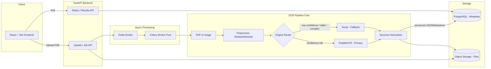
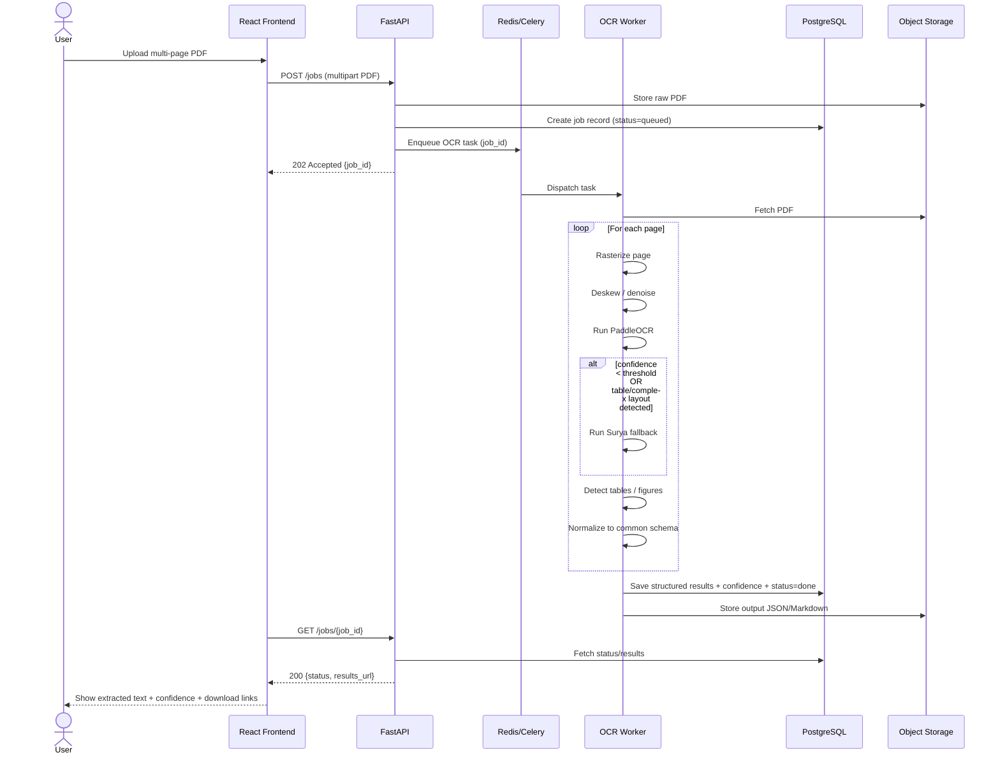
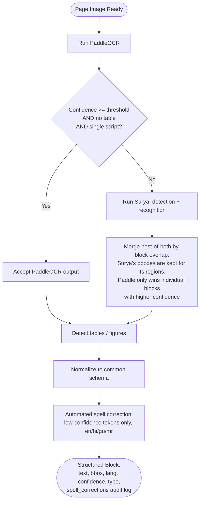
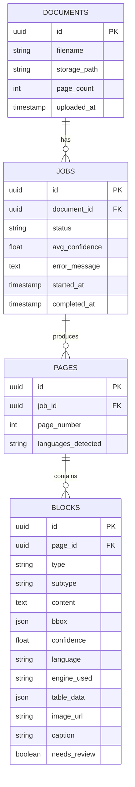
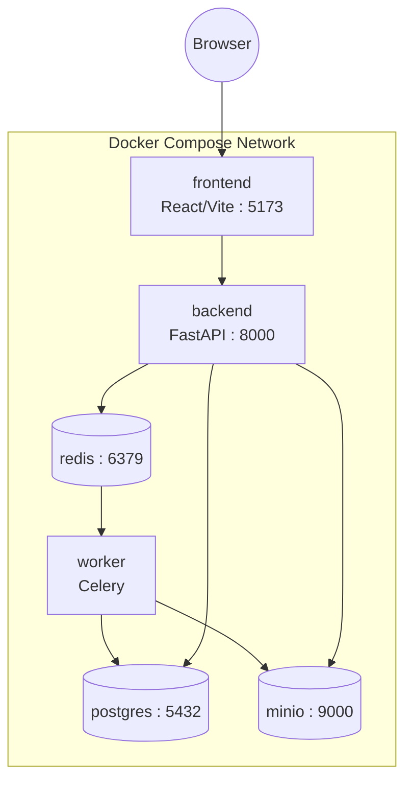

# Multilingual OCR Pipeline — System Architecture

**Project:** DocScribe

> This file describes the system's design: components, data flow, schemas, and contracts. `README.md` covers setup and usage.

---

## 1. Problem Statement

Documents need their textual content extracted reliably so downstream systems (search indexing, data entry automation, compliance checks, analytics) can consume it. Without a robust, language-aware OCR pipeline, multilingual and structurally complex documents fail to process or produce low-quality, unreliable text.

## 2. Solution Overview

An end-to-end, open-source OCR pipeline that:
- Accepts multi-page PDF documents as input
- Produces clean, structured, language-correct extracted text as output
- Is suitable for direct downstream consumption without manual correction

## 3. Design Principles

1. **Open-source first** — no dependency on paid cloud OCR APIs for the core pipeline.
2. **Hybrid engine strategy** — a fast primary OCR engine for the common case, with a layout-aware fallback for hard pages (tables, mixed scripts, low confidence).
3. **Structured output over raw text** — every extraction returns text + layout + confidence + language, not a text blob.
4. **CPU-first, GPU-optional** — the app runs end-to-end without a GPU; a GPU speeds up the fallback path but isn't required.
5. **Downstream-agnostic** — output schema is generic JSON/Markdown so any consumer (search index, RPA bot, compliance scanner) can use it without custom parsing.

---

## 4. OCR Engines

| Engine | Role | Why |
|---|---|---|
| **PaddleOCR** (with a fine-tuned recognition model — see README) | Primary | Fast, CPU-viable, strong multilingual support |
| **Surya** | Fallback | Layout-aware detection + recognition, used selectively for low-confidence, table, or mixed-script pages — not a drop-in recognition swap. Its own layout detection produces the bboxes for the regions it covers, which is what makes it useful on multi-column pages and complex layouts rather than just a second-opinion recognizer. |

Routing between the two is confidence- and layout-driven (see Section 7).

---

## 5. Tech Stack

| Layer | Choice | Why |
|---|---|---|
| Frontend | React + Vite + Tailwind CSS | Fast dev loop, good for upload/preview UI |
| Backend API | FastAPI (Python) | Async-native, same language as the ML pipeline |
| Job Queue | Celery + Redis | Multi-page PDFs are slow — must not block the request thread |
| OCR | PaddleOCR (primary) + Surya (fallback) | See Section 4 |
| PDF → image | PyMuPDF | Page rasterization |
| Preprocessing | OpenCV | Deskew, denoise |
| Spell correction | SymSpell (offline, per-language dictionaries) | Low-confidence token cleanup, en/hi/gu/mr |
| Relational DB | PostgreSQL | Job metadata, document records |
| Object storage | S3-compatible (MinIO locally) | Original PDFs + extracted outputs |
| Deployment | Docker Compose | Reproducible multi-service local setup |

---

## 6. High-Level System Architecture



---

## 7. Data Flow



---

## 8. Engine Routing Logic



---

## 9. Common Output Schema

Every page/document, regardless of which engine produced it, is normalized into this shape before storage or delivery. **JSON is the canonical/authoritative format; Markdown is always a derived export**, never the source of truth — this matters most for tables and multilingual text, where Markdown alone would be lossy.

### 9.1 Multilingual text policy

- Text is stored **in its original language** per block — no auto-translation during extraction.
- Each block carries its own `language` (ISO 639-1) since a single page or document can mix scripts.
- Translation is opt-in and additive: a block may later gain `translated_text` / `translated_lang` fields, but the original `text` field is never overwritten.

### 9.2 Table policy

- Tables are stored as **structured cell data** (rows/cols/cell text/spans/confidence), not a flat text blob — Markdown can't represent merged cells or per-cell confidence.
- Markdown table export is generated from the `table.cells` array; merged cells are flattened as best-effort for the Markdown view, with JSON remaining authoritative for true structure.

### 9.3 Image / chart policy

- Layout-detected figure regions are cropped from the rasterized page and stored as image files in object storage; the JSON block holds a reference URL, not raw bytes.
- Plain images/diagrams: crop + store + attach nearby caption text if detected adjacent to the bbox.
- Charts/graphs: OCR does **not** attempt to extract underlying data values from a chart — that's a different problem, and guessing is worse than not guessing. Chart regions are flagged `subtype: "chart"` with `needs_review: true`.
- `alt_text` is reserved for a future generated-description field, explicitly labeled as generated, never presented as extracted data.

### 9.4 Spell-correction policy

- After normalization, each text block passes through automated, offline spell correction — only for tokens where OCR confidence is below a threshold, and only for languages with a loaded dictionary (currently `en`, `hi`, `gu`, `mr`). Numerics and alphanumeric IDs are never touched, protecting invoice numbers, dates, and codes.
- Every correction is recorded on the block as `spell_corrections: [{original, corrected, edit_distance}]` — an empty list means nothing was changed, not that correction didn't run.

```json
{
  "document_id": "uuid",
  "filename": "sample.pdf",
  "page_count": 12,
  "pages": [
    {
      "page_number": 1,
      "language_detected": ["en", "hi"],
      "blocks": [
        {
          "block_id": "p1_b1",
          "type": "heading | paragraph | table | list | caption | figure",
          "text": "Extracted text content",
          "bbox": [x0, y0, x1, y1],
          "confidence": 0.97,
          "language": "en",
          "engine_used": "paddleocr | surya",
          "translated_text": null,
          "translated_lang": null,
          "spell_corrections": []
        },
        {
          "block_id": "p1_b2",
          "type": "table",
          "bbox": [x0, y0, x1, y1],
          "confidence": 0.91,
          "table": {
            "rows": 4,
            "cols": 3,
            "cells": [
              {"row": 0, "col": 0, "row_span": 1, "col_span": 1, "text": "Item", "is_header": true, "confidence": 0.95},
              {"row": 0, "col": 1, "row_span": 1, "col_span": 2, "text": "Details", "is_header": true, "confidence": 0.93}
            ]
          }
        },
        {
          "block_id": "p1_b3",
          "type": "figure",
          "subtype": "image | chart",
          "bbox": [x0, y0, x1, y1],
          "confidence": 0.88,
          "image_url": "minio://results/doc123/p1_b3.png",
          "caption": "Figure 2: Regional sales breakdown",
          "alt_text": null,
          "needs_review": true
        }
      ]
    }
  ],
  "metadata": {
    "processed_at": "2026-08-07T10:00:00Z",
    "avg_confidence": 0.94,
    "low_confidence_pages": [4, 9]
  }
}
```

Markdown output is derived from this same schema (headings → `#`, tables → GFM tables, figures → ``) so both formats stay in sync with JSON as the source of truth.

---

## 10. Database Schema



> `type` distinguishes heading/paragraph/table/list/caption/figure. `table_data`, `image_url`/`caption`/`needs_review`/`subtype` are sparse — populated only for their relevant block type.

---

## 11. REST API Contract

| Method | Endpoint | Purpose |
|---|---|---|
| `POST` | `/api/v1/jobs` | Upload PDF, create job, returns `job_id` |
| `GET` | `/api/v1/jobs/{job_id}` | Poll job status (`queued`, `processing`, `done`, `failed`) |
| `GET` | `/api/v1/jobs/{job_id}/result?format=json\|markdown` | Fetch structured output |
| `GET` | `/api/v1/jobs/{job_id}/pages/{n}` | Fetch single-page result (with preview image) |
| `POST` | `/api/v1/jobs/{job_id}/reprocess` | Re-run OCR for a document |
| `GET` | `/api/v1/documents` | List uploaded documents (paginated), with latest job status |
| `DELETE` | `/api/v1/documents/{id}` | Remove document, jobs, and stored files |

---

## 12. Deployment (Docker Compose)



The `backend` (API) and `worker` (Celery) services build from the same source tree but install different dependency sets — the API never loads the ML stack, keeping that image small.

---

## 13. Repository Structure

```
ocr-pipeline/
├── ARCHITECTURE.md
├── README.md
├── docker-compose.yml
├── frontend/
│   └── src/
│       ├── components/          # UploadForm, JobStatus, PagePreview, ResultViewer, DocumentList
│       ├── api/                 # API client
│       └── store/                # state management
├── backend/
│   ├── app/
│   │   ├── main.py               # FastAPI entrypoint
│   │   ├── api/routes/           # jobs.py, documents.py
│   │   ├── models/               # SQLAlchemy models
│   │   ├── schemas/              # Pydantic schemas
│   │   ├── services/             # storage.py, queue.py
│   │   └── core/                 # config, db session
│   ├── worker/
│   │   ├── tasks.py               # Celery task definitions
│   │   ├── pipeline/
│   │   │   ├── preprocess.py      # deskew, denoise
│   │   │   ├── engines/           # paddle_engine.py, surya_engine.py, structure_engine.py
│   │   │   ├── router.py          # engine selection logic (Section 8)
│   │   │   ├── normalize.py       # common schema output
│   │   │   ├── spellcheck.py      # offline spell correction
│   │   │   └── dictionaries/      # per-language frequency dictionaries
│   │   └── celery_app.py
│   ├── requirements-common.txt    # shared deps (API + worker)
│   ├── requirements-api.txt       # API-only deps, no ML stack
│   └── requirements-worker.txt    # worker-only deps
├── model/
│   └── paddle/inference/rec_finetuned/   # fine-tuned recognition model — see README
└── infra/
    └── postgres/
```

---

## 14. Non-Functional Requirements

- **Reliability:** a failed page must not fail the whole document job — partial results with per-page status.
- **Observability:** structured logs per job/page, average confidence tracked per job.
- **Idempotency:** re-uploading the same file should be safe to reprocess independently.
- **Extensibility:** the engine router is designed to support adding new engines without touching the schema layer.
