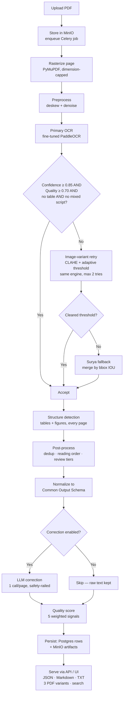

# DocScribe

**DocScribe** is a multilingual OCR pipeline for extracting clean, structured text from multi-page PDFs — scanned or born-digital. It combines a fine-tuned recognition model with a layout-aware fallback engine, producing structured JSON (text, bounding boxes, confidence, language, tables, figures) rather than a flat text blob, plus a set of derived exports.

---

## Features

- **Multilingual OCR** — English, Hindi, Marathi, Gujarati, via a fine-tuned recognition model (see below), with a layout-aware fallback for everything else.
- **Structured output** — text blocks with bounding boxes, per-block confidence, and language; tables as structured row/column/cell data; figures and charts cropped from scanned or born-digital pages alike and linked in the output, with captions matched where detectable.
- **Image-variant retry** — pages below the confidence/quality threshold are retried against contrast-enhanced and adaptive-threshold variants before falling back to a secondary engine; the winning attempt is recorded per page.
- **Explicit OCR quality score** — a 0–1 per-page score from five weighted signals, used alongside confidence to gate retries, not just reported.
- **API-based post-OCR correction** (optional, off by default) — garbled/low-confidence text corrected via a configurable LLM provider, with strict safety rails: never translates, never touches numbers/names/codes, rejects rewrite-sized edits, never crashes the pipeline on API failure.
- **Full-text search** — PostgreSQL full-text search across every OCR'd page, no additional service.
- **Six export formats** — JSON (canonical), Markdown, TXT, Searchable PDF, Highlighted PDF, Structured PDF — see the table below.
- **Document management UI** — upload, track status, search, and download results from a single dashboard.

## System Flow



Full technical version of this diagram (with routing internals and DB schema): [`ARCHITECTURE.md §8`](./ARCHITECTURE.md#8-engine-routing-logic).

## How to run

```bash
docker compose up --build
```

- Frontend: [http://localhost:5173](http://localhost:5173)
- Backend API docs: [http://localhost:8000/docs](http://localhost:8000/docs)
- MinIO console: [http://localhost:9001](http://localhost:9001)

Copy `.env.example` to `.env` first. `docker-compose.yml` loads it via `env_file` for both `backend` and `worker` — after editing `.env`, recreate the affected service (`docker compose up -d worker`) rather than `restart`, since `restart` does not reload `env_file`.

Full API contract and system design: [`ARCHITECTURE.md`](./ARCHITECTURE.md).

### Download formats

| Format | What it is |
|---|---|
| `json` | Canonical structured output — source of truth for every other format |
| `markdown` | Headings/tables/figures rendered as Markdown |
| `txt` | Plain text, page-by-page, in reading order |
| `searchable_pdf` | Original page image with an invisible, searchable text layer |
| `highlighted_pdf` | Same, plus a color overlay per block keyed to detected language, with a legend |
| `structured_pdf` | Clean reconstruction from scratch — text, tables, and figures redrawn at their position, no background scan |

## Project Structure

```
ocr-pipeline/
├── backend/        # FastAPI app (API) + Celery worker (OCR pipeline, pipeline/ subpackage)
├── frontend/        # React + Vite + TypeScript + Tailwind dashboard
├── infra/           # PostgreSQL init SQL
├── model/           # Deployed fine-tuned recognition model (inference export)
├── evaluation/       # Recognition benchmark, real-PDF outputs, and test/benchmark scripts
├── README.md
├── ARCHITECTURE.md   # System design, diagrams, DB schema, full API contract
├── docker-compose.yml
├── .env.example
└── .gitignore
```

## Fine-Tuned Recognition Model

DocScribe's primary engine uses a fine-tuned PaddleOCR PP-OCRv6 recognition model for **English, Hindi, Marathi, and Gujarati** — the currently deployed version is **V5**.

- **Training data:** synthetic text lines rendered across **23 font families**
- **Dictionary:** 660 characters (Latin, Devanagari, Gujarati, symbols)
- **Training:** 20 epochs, batch size 8, learning rate 0.0005, fine-tuned from the pretrained PP-OCRv6 recognition checkpoint

### Model Training Timeline

| Version | Training setup | Languages | Dictionary / Characters | Epochs | Batch Size | Learning Rate | Result / Status |
|---|---|---:|---:|---:|---:|---:|---|
| V1 | Default pretrained model | 8 | ~38K characters | 10 | 6 | 0.0005 | Best accuracy 90.26%, but showed incorrect predictions; Kannada relatively good, Bengali weaker/biased |
| V2 | Fine-tuned on custom dataset | 8 | ~171K characters | 15 | 6 | 0.0005 | Best accuracy 98.25%, normalized edit similarity ~99.50%; predictions still sometimes wrong |
| V3 | Fine-tuned on default/pretrained model | 8 | ~70K dictionary characters | 20 planned | 8 | 0.0003 | Halted/cancelled; not used as final model |
| V4 | Fresh fine-tuning from original PP-OCRv6 pretrained checkpoint | 4 | 326 dictionary chars; 287 used; 0 missing | 20 | 8 | 0.0003 | 60.18% validation accuracy, 97.29% edit similarity |
| **V5** | **Final configuration (deployed)** | **4** | **660-character dictionary** | **20** | **8** | **0.0005** | **23 font families. On `evaluation/recognition`'s 100-sample synthetic set: avg CER 4.66% (95.34% character accuracy), avg WER 15.58% — see Evaluation below** |

V5's numbers above are CER/WER on a different, purpose-built validation set than V1–V4's exact-match/edit-similarity numbers — the two are not directly comparable; see Evaluation for methodology.

## Evaluation

`evaluation/` holds everything needed to reproduce the numbers in this README:

```
evaluation/
├── recognition/     # 100 synthetic validation images (25/language) + comparison.csv + summary.csv
├── real_pdf/         # input/ (real PDFs) and outputs/ (every export format, per PDF)
└── scripts/          # run_benchmark.py, run_e2e_test.py, requirements.txt
```

**Recognition benchmark** — compares deployed V5 against stock `PP-OCRv6_medium_rec` on a 100-sample **synthetic** validation set (25 short phrases per language, rendered text — not real scans):

```bash
docker compose exec worker python evaluation/scripts/run_benchmark.py \
    --val-list evaluation/recognition/val_list.txt
```

| Language | V5 CER | V5 WER | Stock CER | Stock WER |
|---|---:|---:|---:|---:|
| en | 0.55% | 3.67% | 1.67% | 7.33% |
| gu | 4.72% | 17.67% | 92.00% | 100.00% |
| hi | 8.97% | 26.67% | 95.33% | 100.00% |
| mr | 4.42% | 14.33% | 94.01% | 100.00% |

Full per-sample results: [`evaluation/recognition/comparison.csv`](./evaluation/recognition/comparison.csv) / [`evaluation/recognition/summary.csv`](./evaluation/recognition/summary.csv).

Sample predictions (5 rows per language):

| Language | Actual | V5 Prediction | CER |
|---|---|---|---:|
| en | Invoice Number 48213 | Invoice Number 48213 | 0.00% |
| en | Total Amount Due 1024.50 | Total Amount Due 1024.50 | 0.00% |
| en | Payment Terms Net 30 Days | Payment Terms Net 30 Days | 0.00% |
| en | Shipping Address London | Shipping Addess London | 4.35% |
| en | Customer Name John Smith | Customer Name John Smith | 0.00% |
| hi | नमस्ते भारत | नमस्ते भारत | 0.00% |
| hi | कुल राशि चालान | कुल राश चिाान | 21.43% |
| hi | धन्यवाद आभार | धन्यवाद आभार | 0.00% |
| hi | संख्या और तारीख | संख्या और तारीख | 0.00% |
| hi | ग्राहक का नाम राज | ग्राहक का नाम राज | 0.00% |
| mr | नमस्कार महाराष्ट्र | नमस्कार महाराष्ट्र | 0.00% |
| mr | एकूण रक्कम दिनांक | एकूण रक्कम दनिांक | 11.76% |
| mr | धन्यवाद आपले | धन्यवाद आपले | 0.00% |
| mr | पावती क्रमांक | पावती क्रमांक | 0.00% |
| mr | ग्राहकाचे नाव सुरेश | ग्राहकाचे नाव सुरेश | 0.00% |
| gu | નમસ્તે ગુજરાત | નમસ્તે ગુજાત | 7.69% |
| gu | કુલ રકમ તારીખ | કુલ રકમ તારીખ | 0.00% |
| gu | આભાર તમારો | આભાર તમમાારો | 20.00% |
| gu | ચલણ નંબર | ચલણ ન નબર | 25.00% |
| gu | ગ્રાહકનું નામ પટેલ | ગ્રાહકનું નામ પટેલ | 0.00% |

**End-to-end pipeline test** — uploads a real PDF to a running stack and checks every download format:

```bash
pip install -r evaluation/scripts/requirements.txt
pytest evaluation/scripts/run_e2e_test.py -v
```

**Real-PDF processing** — `evaluation/real_pdf/` contains two real PDFs run through the full pipeline (upload → OCR → correction → every export format); see the per-document results below.

| PDF | Pages | Blocks | Avg Confidence | Avg Quality Score | Figures Cropped |
|---|---:|---:|---:|---:|---:|
| `real_sample.pdf` | 3 | 39 | 95.32% | 89.53% | 1 |
| `real_sample1.pdf` | 3 | 68 | 91.88% | 79.18% | 2 |

Figure crops are stored in MinIO at `results/{job_id}/p{page}_b{block}.png` and copied into `evaluation/real_pdf/outputs/<name>/figure_*.png` — e.g. `real_sample.pdf`'s page-3 figure (`p3_b5.png`, 997KB) and `real_sample1.pdf`'s two figures (`p1_b27.png`, `p2_b26.png`).

Correction (Gemini) was applied to 7/39 blocks on `real_sample.pdf` and 21/68 on `real_sample1.pdf` — most of the remaining pages fell back to raw OCR text after exhausting retries against a Gemini API that was returning intermittent `503 UNAVAILABLE` ("high demand") during this run, which the pipeline handles by design (log it, keep the raw text, never fail the job). A few genuine before/after examples, with every number and identifier unchanged:

| Original (raw OCR) | Corrected | What changed |
|---|---|---|
| વર૨સે છે વાયરોને ધોધમા૨ ચોમાસું - ખાલીખમ. સોરવરમાં વા વળો | વરસે છે વાયરોને ધોધમાર ચોમાસું - ખાલીખમ સરોવરમાં વા વળો | Stray digit "૨" removed from two words; "સોરવરમાં"→"સરોવરમાં" spelling fix |
| ંધારી સાંજનો. વાવી ઉજગરો બાર-બાર બાઉ મેં બાંધ્યો ઉ ઉાળો ! | અંધારી સાંજનો વાવી ઉજાગરો બાર-બાર ગાઉ મેં બાંધ્યો છે માળો ! | Missing leading letter restored; "બાઉ"→"ગાઉ", "ઉાળો"→"માળો" OCR-garble fixes |
| ક્રમાlક: | ક્રમાંક: | Latin "l" misread for Gujarati matra, fixed |
| વિદ્યાર્થાીએ અમારી સેસ્થામાં ચઆાલ સેમેસ્ટર / /7 અથવા વર્ષ 1/2//4 માં રૂ | વિદ્યાર્થીએ અમારી સંસ્થામાં ચાલુ સેમેસ્ટર / /7 અથવા વર્ષ 1/2//4 માં રૂ | Spelling fixes only — `/ /7` and `1/2//4` (semester/year codes) byte-for-byte unchanged |
| ંપ્રથમ વર્ષે અરજી કા વર્ષ ૨૬૨૭માં પ્વેશ પેવવેલ વિર્યા્થી માટે | (પ્રથમ વર્ષે અરજી કરતા વર્ષ ૨૬૨૭માં પ્રવેશ મેળવેલ વિદ્યાર્થી માટે) | Spelling/grammar fixes only — the year "૨૬૨૭" (Gujarati numerals) is byte-for-byte unchanged |

Full per-document outputs (all 6 formats + figure crops): [`evaluation/real_pdf/outputs/`](./evaluation/real_pdf/outputs/).

## Privacy & Cost

Post-OCR correction is **optional and off by default** (`CORRECTION_PROVIDER=none`). When a provider (Anthropic, OpenAI, or Gemini) is configured, page text is sent to that provider's API for correction, batched one call per page. Both `original_text` (raw OCR) and `corrected_text` are always stored, so a correction can be audited or reverted.

**Measured token usage** (from the two successful Gemini calls in the real-PDF run above, one page each): 871+1538 = 2,409 input tokens and 474+1,089 = 1,563 output tokens across 2 pages — averaging **~1,205 input / ~782 output tokens per page**. At Gemini Flash-tier list pricing (~$0.10/M input, ~$0.40/M output — confirm the current rate at [ai.google.dev/pricing](https://ai.google.dev/pricing), since this varies by model and changes over time), that's roughly:

```
(1205 / 1,000,000 × $0.10) + (782 / 1,000,000 × $0.40) ≈ $0.00043 / page
≈ $0.43 per 1,000 pages
```

This is a rough order-of-magnitude figure from a two-sample measurement, not a billed-cost guarantee — actual cost scales with page text density and varies by provider/model choice.

## License

See [`LICENSE`](./LICENSE).
